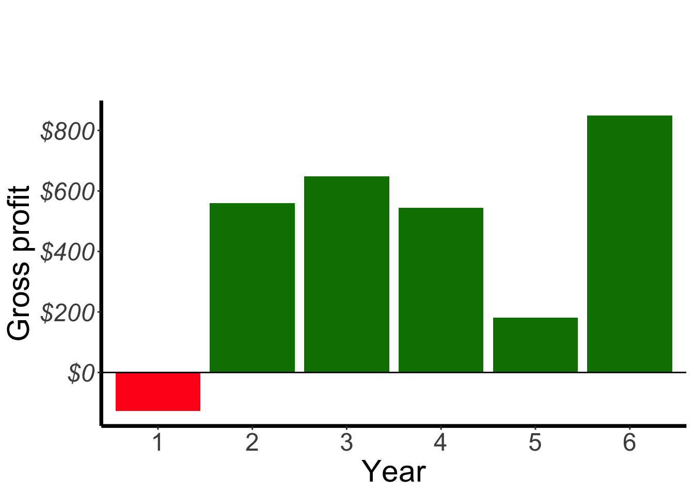
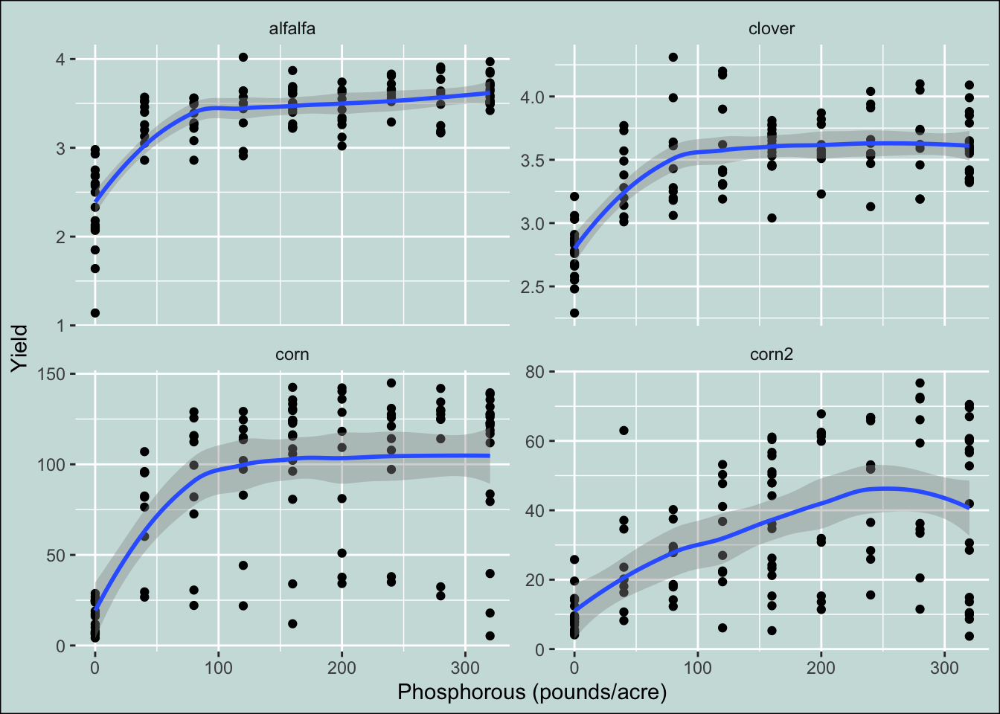
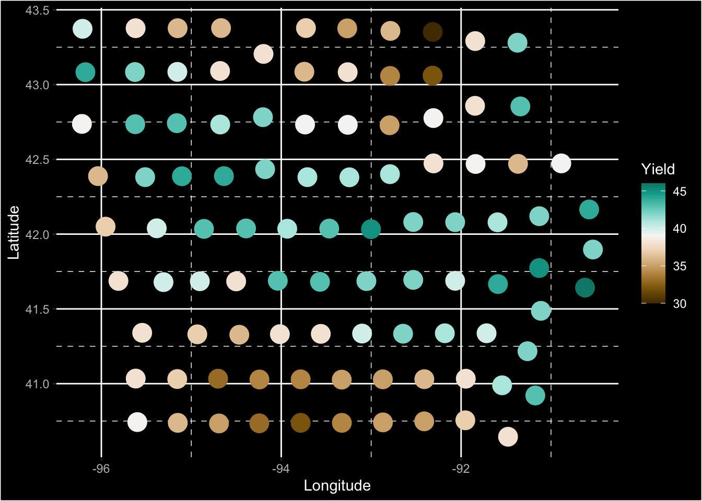

Push the `knit` button!


```{r setup, child="exercise-setup.Rmd", eval = file.exists("exercise-setup.Rmd")}
```

```{r pkgs, message = FALSE, warning = FALSE}
library(tidyverse) # contains ggplot2, dplyr, tidyr, etc
library(scales)
library(colorspace)
library(agridat) # for datasets
```

## `hazell.vegetables` dataset

```{r hazell-vegetables}
glimpse(hazell.vegetables)
```

### Exercise 4.1

```{r part1-exercise-04-01, echo = F, class = "target"}

```

* This is a jazzy plot version of Exercise 3.3 plot.

```{r part1-exercise-04-01s, eval = FALSE}
# fill all ... and change eval = FALSE to eval = TRUE when done
ggplot(hazell.vegetables, aes(year, celery, fill = celery > 0)) + 
  geom_col(show.legend = FALSE) + 
  geom_hline(yintercept = 0) + 
  scale_y_continuous(labels = dollar) + 
  labs(y = "Gross profit", x = "Year",
       title = "Celery", fill = "Profit") +
  scale_fill_manual(values = c("#ff1a1a", "#008000")) +
  scale_x_discrete(labels = 1:6) + 
  theme(axis.text = ...(size = 18),
        axis.text.y = ...(face = "italic"),
        axis.title = element_text(size = 22),
        plot.title = element_text(size = 30, face = "bold",
                                  margin = margin(b = 40),
                                  hjust = -0.8),
        panel.background = ...(fill = "transparent"),
        axis.line = ...(color = "black",
                                 size = 1.3))
```

## `heady.fertilizer` dataset

```{r heady-fertilizer}
glimpse(heady.fertilizer)
```

### Exercise 4.2

```{r part1-exercise-04-02, echo = F, class = "target"}

```

* The plot background color is `#CCDFDD`.

```{r part1-exercise-04-02s, eval = FALSE}
# fill all ... and change eval = FALSE to eval = TRUE when done
ggplot(heady.fertilizer, aes(P, yield)) +
geom_point() + facet_wrap(~crop, scale = "free_y") + 
  geom_smooth() + 
  labs(x = "Phosphorous (pounds/acre)",
       y = "Yield") + 
  theme(... = element_rect(fill = "#CCDFDD", color = "black"),
        ... = element_rect(fill = "transparent"),
        ... = element_rect(fill = "transparent"))
```

## `wallace.iowaland` dataset

```{r wallace-iowaland}
glimpse(wallace.iowaland)
```


### Exercise 4.3

```{r part1-exercise-04-03, echo = F, class = "target"}

```

* Note: the diverging palette used is `Green-Brown` from `colorspace` with mid-point as average of the yield. 

```{r part1-exercise-04-03s, eval = FALSE}
# fill all ... and change eval = FALSE to eval = TRUE when done
ggplot(wallace.iowaland, aes(long, lat, color = yield)) + 
  ...(size = 6) +
  scale_color_continuous_diverging(palette = "Green-Brown", rev = TRUE, mid = mean(wallace.iowaland$yield)) + 
  ...(y = "Latitude", x = "Longitude", color = "Yield") +
  theme(rect = ...(fill = "black"),
        text = ...(color = "white"),
        panel.background = ...(fill = "transparent"),
        panel.grid.minor = ...(linetype = "dashed"),
        axis.text = ...(color = "gray"))
```
