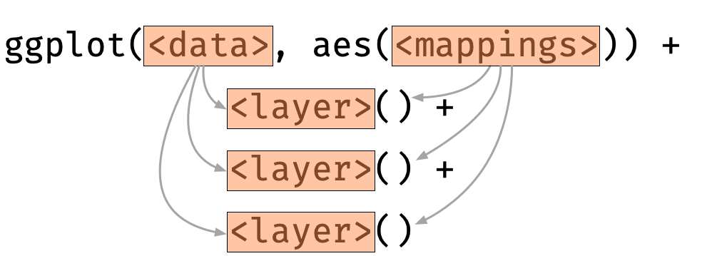
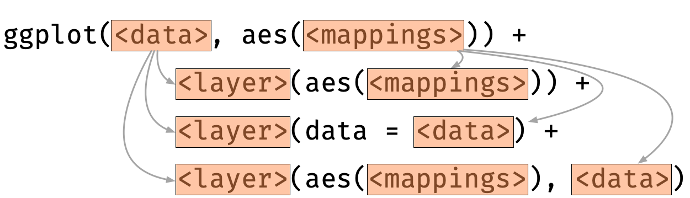
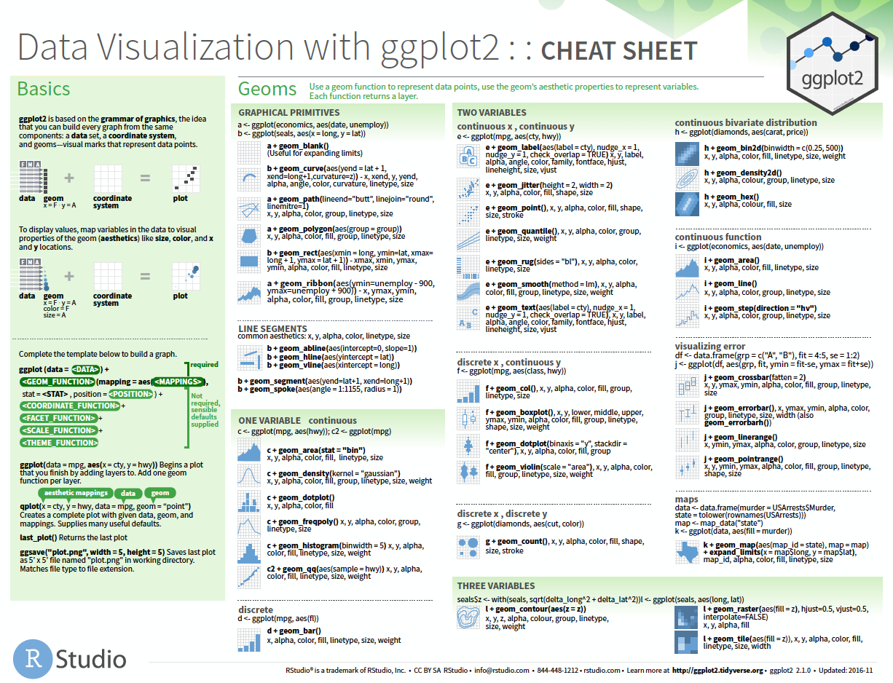

```{r, include = FALSE}
current_file <- knitr::current_input()
```
```{r titleslide, child="assets/titleslide.Rmd"}
```
```{r, include = FALSE}
knitr::opts_chunk$set(
  fig.path = "images/part1-session2/",
  warning = FALSE,
  message = FALSE, 
  fig.align = "center"
)
library(tidyverse)
library(palmerpenguins)
```

---

# Add multiple layers

<center>

</center>


.grid.font_smaller[

.item[

Each layer inherits mapping and data from `ggplot` by default.  


```{r plot1, eval=FALSE}
ggplot(penguins, aes(x = species, y = bill_length_mm)) +
  geom_violin() + 
  geom_boxplot() + 
  geom_point()
```
]

.item[

```{r plot1, echo = FALSE, fig.height = 4, fig.width = 4}
```

]

]


---

class: font_smaller

# Order of the layers matters!

Boxplot and violin plot order are switched around. 

<div class="grid" style="grid: 250px 250px / 1fr 1fr;">

.item[

```{r plot1a, eval=FALSE}
ggplot(penguins, aes(species, bill_length_mm))  +
  geom_violin() + #<<
  geom_boxplot() + #<<
  geom_point()
```

]

.item[ 

```{r plot1a, echo = FALSE, fig.height = 3, fig.width = 4, fig.align="center"}
```

]

.item[ 

```{r plot1b, eval=FALSE}
ggplot(penguins, aes(species, bill_length_mm)) +
  geom_boxplot() + #<<
  geom_violin() + #<<
  geom_point()
```


]

.item[ 

```{r plot1b, echo = FALSE, fig.height = 3, fig.width = 4, fig.align="center"}
```

]

</div>


---

class: font_smaller

# Layer-specific data and aesthestic mappings

<center>

</center>

.grid[

.item[ 

For each layer, aesthestic and/or data can be overwritten.


```{r plot2, eval=FALSE}
ggplot(penguins, aes(species, bill_length_mm)) +
  geom_violin(aes(fill = species)) +
  geom_boxplot(data = filter(penguins, species=="Adelie")) +
  geom_point(data = filter(penguins, species=="Gentoo"),
             aes(y = bill_depth_mm))
```


]

.item[


```{r plot2, echo = FALSE, fig.width = 5, fig.height = 4.5}
```


]

]

---

class: font_smaller

# Aesthestic or Attribute?

.grid[.item[

Not what you want
```{r, fig.height = 2.5, fig.width = 4.5}
ggplot(penguins) + 
  geom_point(aes(body_mass_g, 
                 bill_depth_mm, 
                 color = "blue"))
```
]
.item[
{{content}}
]
]

--

What you want

```{r, fig.height = 2.5, fig.width = 3.5}
ggplot(penguins) + 
  geom_point(aes(body_mass_g, 
                 bill_depth_mm), 
             color = "blue")
```

{{content}}

--


Tip: the `I` operator will yield the same as above.

```r
ggplot(penguins) + 
  geom_point(aes(body_mass_g, 
                 bill_depth_mm, 
                 color = I("blue")))
```

---

class: font_smaller

# `group` in `ggplot`

.grid[
.item[
```{r, fig.height = 2.5, fig.width = 5}
ggplot(penguins, 
       aes(body_mass_g, 
           bill_depth_mm)) + 
  geom_point(aes(color = species)) +
  geom_smooth(method = "lm")
```
* This is an obvious case of Simpson's paradox.
* What if we wanted to draw the fit of a simple linear model for each cluster?
]
.item[

{{content}}

]
]

--

```{r, fig.height = 4.5, fig.width = 6}
ggplot(penguins, 
       aes(body_mass_g, 
           bill_depth_mm)) + 
  geom_point(aes(color = species)) +
  geom_smooth(method = "lm", 
              aes(group = species=="Gentoo"))
```


---

class: font_smaller 

# Facetting

```{r}
g <- ggplot(penguins, aes(bill_length_mm, bill_depth_mm, color = species)) + geom_point()
```

--- 

.grid[

.item[ 

```{r, fig.width = 5, fig.height = 2.5}
g
```


```{r plot3, fig.width = 7, fig.height = 2.5}
g + facet_wrap(~sex)
```

]

.item[


```{r, fig.width = 7, fig.height = 5}
g + facet_grid(island ~ sex)
```

]

]

---

class: font_small

# `facet_wrap` and `facet_grid`


.grid[

.item[ 

```{r, fig.width = 7, fig.height = 2.5}
g + facet_wrap( ~ sex)
```

```{r, fig.width = 4, fig.height = 4}
g + facet_wrap( ~ sex, ncol = 1)
```

]

.item[


```{r, fig.width = 7, fig.height = 2.5}
g + facet_grid(. ~ sex)
```

```{r, fig.width = 4, fig.height = 4}
g + facet_grid(sex ~ .)
```


]

]

---

background-color: #e5e5e5

<div class="grid" style="grid: 1fr / 3fr 1fr;">

.item[ 

<a href="https://github.com/rstudio/cheatsheets/blob/master/data-visualization-2.1.pdf"></a>

]

.item[ 

HELP!

* RStudio > Help > Cheatsheets
* [R4DS Community Slack](https://www.rfordatasci.com/)
* [Twitter with hastag #rstats](https://twitter.com/search?q=%23rstats)
* [RStudio Community](https://community.rstudio.com/)
* [Stackoverflow](https://stackoverflow.com/questions/tagged/ggplot)


]

</div>


---

class: transition middle animated slideInLeft

# .circle-big[2]

# Tidying your data

.footnote.monash-bg-blue[
Wickham (2014) Tidy Data. *Journal of Statistical Software* 59 (10): 1–23.
]

---

class: font_small

# Weight gain in pigs for different treatments

The `crampton.pig` is from the `agridat` 📦

```{r}
library(agridat)
glimpse(crampton.pig)
```

`weight1` is initial weight and `weight2` is final weight


.footnote[
Wright (2018). agridat: Agricultural Datasets. R package version 1.16. https://CRAN.R-project.org/package=agridat

Crampton and Hopkins (1934). The Use of the Method of Partial Regression in the Analysis of Comparative Feeding Trial Data, Part II. *The Journal of Nutrition* 8 113-123.
]

---

class: font_smaller

<br>

```{r}
names(crampton.pig)
```


```{r pig-df, echo = FALSE, fig.width = 12, fig.height=3}
pig_df <- crampton.pig %>% 
 mutate(id = paste0("pig", 1:n())) %>% 
 pivot_longer(c(weight1, weight2),
            names_to = "when",
            values_to = "weight") %>% 
 mutate(when = factor(when, 
         levels = c("weight1", "weight2"),
         labels = c("initial", "final")))
```

```{r pig-plot, echo = FALSE, fig.height=2.5, fig.width=12}
ggplot(pig_df, aes(when, weight)) + # tidying your data for plotting
  geom_point(size = 3) + # attribute not aesthestic
  geom_line(aes(group = id)) + # grouping 
  facet_grid(. ~ treatment) + # facetting
  labs(x = "") # we'll learn this in the last session
```

What are the mappings to get the above graph? 🤔

```{r, eval = F}
ggplot(crampton.pig, aes(x = ???, y = ???)) + 
  geom_point() + 
  geom_line() + 
  facet_grid(. ~ treatment)
```
.center[
🤨
]

---

class: font_smaller

# Getting the data in the right form

```{r pig-plot, echo = FALSE, fig.width = 12, fig.height = 2.5}
```
.grid[.item.border-right[
* The x-axis is the time when pig was weighed 
* The y-axis is the weight
* The facetting is by treatment

```{r, echo = FALSE}
pig_df %>% select(-rep)
```
]
.item[

{{content}}

]]

--

How I wrangled this data

```{r pig-df, eval = FALSE}
```

<div class="font_small">
(note: teaching wrangling is not part of this workshop, please see <a href="http://emitanaka.org/datawrangle-workshop-ssavic" target="_blank">here</a> if you want to learn more)
</div>

---

class: font_small

# Putting it all together


```{r pig-plot, fig.width = 12, fig.height = 2.5}
```

---

class: font_smaller

# Meaningfully order categorical variables

.grid[
.item.border-right[
```{r, fig.height = 3}
ggplot(crampton.pig, 
  aes(treatment, weight2 - weight1)) + 
  geom_point(size = 3)
```

* Treatments are ordered alphabetically by default
* It's better to order categorical variables meaningfully
]
.item[
{{content}}
]
]

--

Order factor levels by the mean of the weight difference.
```{r, fig.height = 2.5}
library(forcats) #  for easy factor manipulation
crampton.pig2 <- crampton.pig %>% 
 mutate(
  treatment = fct_reorder(treatment, 
                          weight2 - weight1,
                          mean))
ggplot(crampton.pig2, 
       aes(treatment, weight2 - weight1)) + 
  geom_point(size = 3)
```


---

class: font_smaller

# Plotting auxilliary data

.grid[
.item[

Plot you may want:

```{r diff-plot, fig.height = 3.5, echo = F}
fig <- ggplot(crampton.pig2, 
              aes(treatment, 
                  weight2 - weight1)) + 
  geom_point(size = 3) + 
  stat_summary(fun.data = mean_se, 
               geom = "pointrange", fatten = 2,
               color = "#027EB6", size = 3) +
  stat_summary(fun = mean, geom = "line", 
               group = 1, color = "#027EB6",
               size = 2)
fig
```

]
.item[


{{content}}

]
]

--

One way to do this:

```{r diff-plot, eval = F, echo=-11}
```


---

class: font_smaller

# Plotting annotations

.grid[
.item.border-right[

```{r, fig.height = 4, fig.width = 5}
fig + 
  geom_text(data = data.frame(treatment = 4.5,
                              weight2 = 185,
                              weight1 = 0),
            label = "Treatment\n means",
            size = 3,
            color = "#027EB6", 
            fontface = "bold") 
```
]
.item[
{{content}}
]
]

--

But it might be just easier to:

```{r, fig.height = 4, fig.width = 5}
fig + 
  annotate("text",
           x = 4.5, y = 185,
           label = "Treatment\n means",
           size = 3,
           color = "#027EB6", 
           fontface = "bold") 
```


---

class: exercise middle hide-slide-number


<i class="fas fa-users"></i>

# <i class="fas fa-code"></i> Open `part1-exercise-02.Rmd`

<center>
`r countdown::countdown(15, class = "clock")`
</center>


---

```{r endslide, child="assets/endslide.Rmd"}
```

