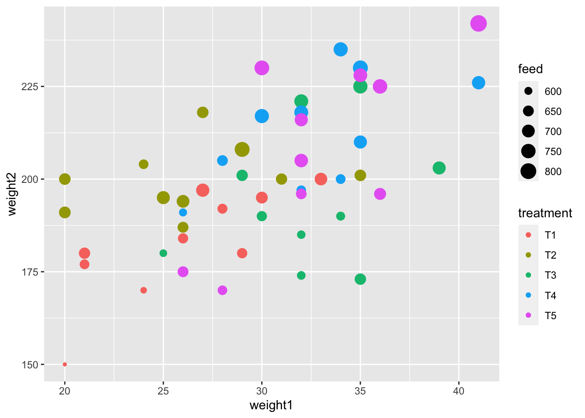
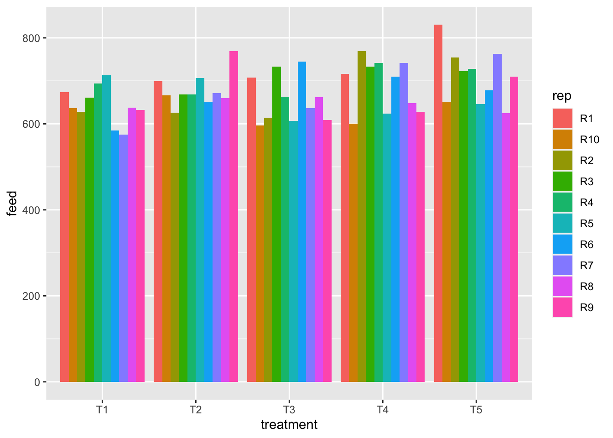
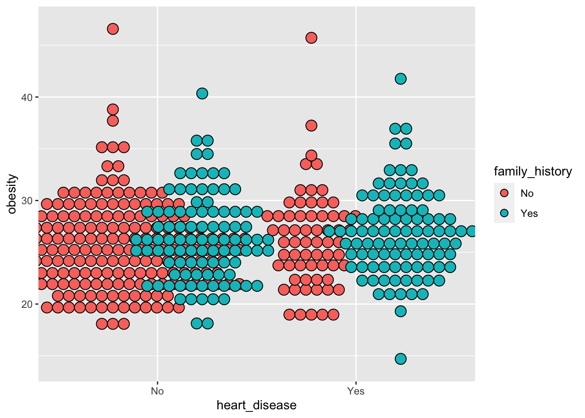
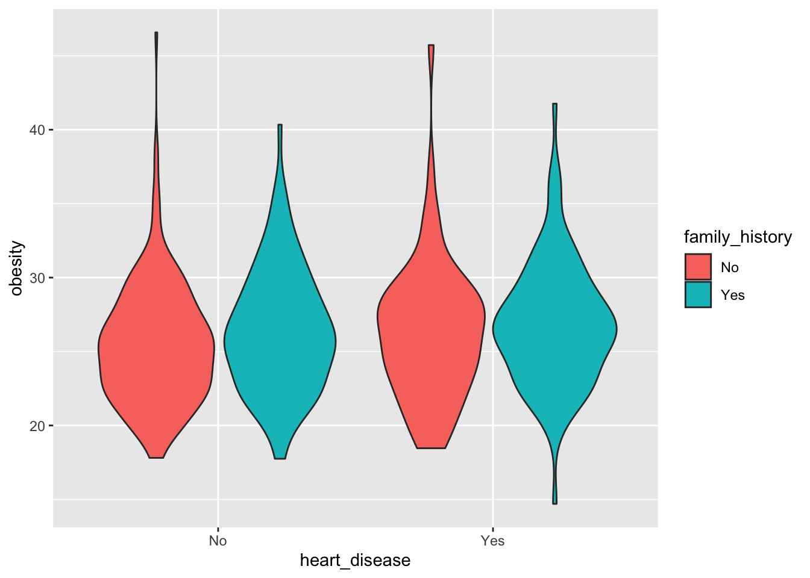
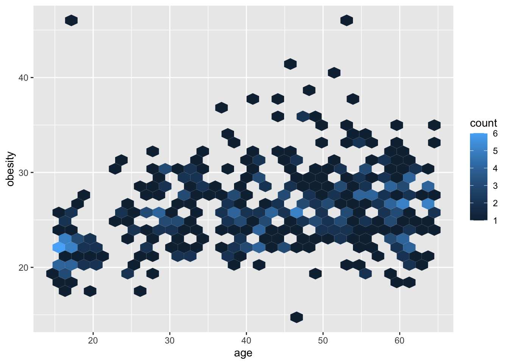

Push the `knit` button!


```{r setup, child="exercise-setup.Rmd"}
```
```{r pkgs, message = FALSE, warning = FALSE}
library(tidyverse) # contains ggplot2, dplyr, tidyr, etc
library(agridat) # for `crampton.pig` data
library(catdata) # for `heart` data
```

## `crampton.pig` dataset

```{r pig-data}
glimpse(crampton.pig)
```

### Exercise 1: Scatterplot

```{r exercise-01, echo = F, class = "target"}

```

```{r exercise-01s}
# add your code here!
```

### Exercise 2: Tile plot

```{r exercise-02, echo = F, class = "target"}
knitr::include_graphics("day1-exercise-01/exercise-02-1.png")
```

```{r exercise-02s}
# add your code here!
```

### Exercise 3: Density plot

```{r exercise-03, echo = F, class = "target"}
knitr::include_graphics("day1-exercise-01/exercise-03-1.png")
```

```{r exercise-03s}
# add your code here!
```

### Exercise 4: Grouped barplot

```{r exercise-04, echo = F, class = "target"}

```

```{r exercise-04s}
# add your code here!
```

### Exercise 5: Rose plot

```{r exercise-05, echo = F, class = "target"}
knitr::include_graphics("day1-exercise-01/exercise-05-1.png")
```

```{r exercise-05s}
# add your code here!
```

## `heart` dataset

```{r heart-data}
data("heart")
# cleaning a bit of the `heart` data
heart2 <- heart %>% 
  as_tibble(heart) %>% 
  mutate(family_history = ifelse(famhist==1, "Yes", "No"),
         heart_disease = ifelse(y==1, "Yes", "No"))

glimpse(heart2)
```

### Exercise 6: Boxplot

```{r exercise-06, echo = F, class = "target"}
knitr::include_graphics("day1-exercise-01/exercise-06-1.png")
```

```{r exercise-06s}
# add your code here!
```

### Exercise 7: Dotplot

```{r exercise-07, echo = F, class = "target"}

```

```{r exercise-07s}
# add your code here!
```

### Exercise 8: Violin plot

```{r exercise-08, echo = F, class = "target"}

```

```{r exercise-08s}
# add your code here!
```

### Exercise 9: 2D density plot

```{r exercise-09, echo = F, class = "target"}
knitr::include_graphics("day1-exercise-01/exercise-09-1.png")
```

```{r exercise-09s}
# add your code here!
```

### Exercise 10: Hexagonal heatmap

```{r exercise-10, echo = F, class = "target"}

```

```{r exercise-10s}
# add your code here!
```
