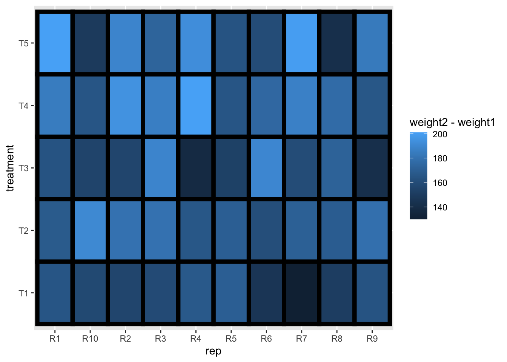
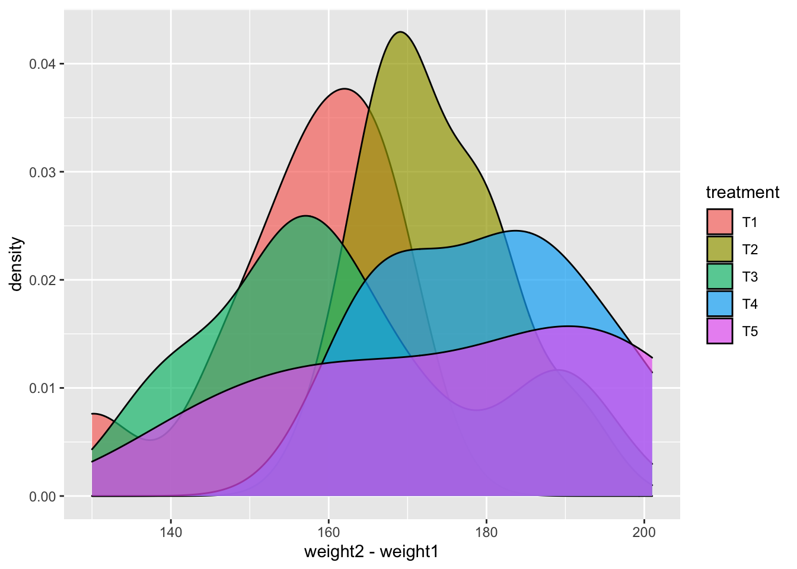
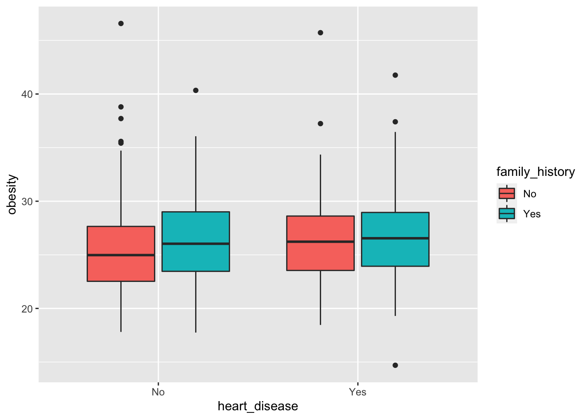
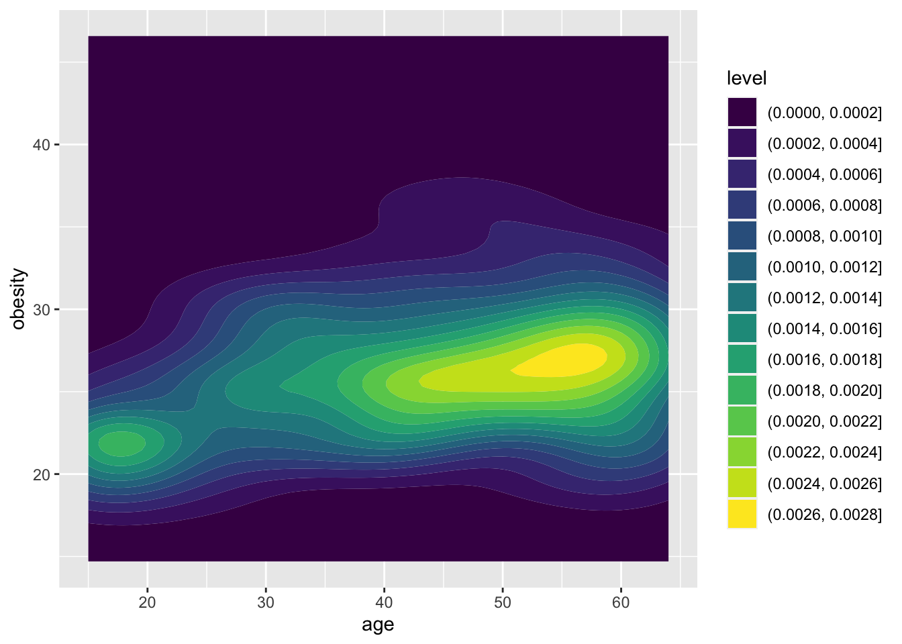

Push the `knit` button!


```{r setup, child="exercise-setup.Rmd"}
```
```{r pkgs, message = FALSE, warning = FALSE}
library(tidyverse) # contains ggplot2, dplyr, tidyr, etc
library(agridat) # for `crampton.pig` data
library(catdata) # for `heart` data
```

## `crampton.pig` dataset

```{r pig-data}
glimpse(crampton.pig)
```

### Exercise 1.1: Scatterplot

```{r day1-exercise-01-01, echo = F, class = "target"}
knitr::include_graphics("images/day1-exercise-01/day1-exercise-01-1.png")
```

```{r day1-exercise-01-01s}
# add your code here!
```

### Exercise 1.2: Tile plot

```{r day1-exercise-01-02, echo = F, class = "target"}

```

```{r day1-exercise-01-02s}
# add your code here!
```

### Exercise 1.3: Density plot

```{r day1-exercise-01-03, echo = F, class = "target"}

```

```{r day1-exercise-01-03s}
# add your code here!
```

### Exercise 1.4: Grouped barplot

```{r day1-exercise-01-04, echo = F, class = "target"}
knitr::include_graphics("images/day1-exercise-01/day1-exercise-04-1.png")
```

```{r day1-exercise-01-04s}
# add your code here!
```

### Exercise 1.5: Rose plot

```{r day1-exercise-01-05, echo = F, class = "target"}
knitr::include_graphics("images/day1-exercise-01/day1-exercise-05-1.png")
```

```{r day1-exercise-01-05s}
# add your code here!
```

## `heart` dataset

```{r heart-data}
data("heart")
# cleaning a bit of the `heart` data
heart2 <- heart %>% 
  as_tibble(heart) %>% 
  mutate(family_history = ifelse(famhist==1, "Yes", "No"),
         heart_disease = ifelse(y==1, "Yes", "No"))

glimpse(heart2)
```

### Exercise 1.6: Boxplot

```{r day1-exercise-01-06, echo = F, class = "target"}

```

```{r day1-exercise-01-06s}
# add your code here!
```

### Exercise 1.7: Dotplot

```{r day1-exercise-01-07, echo = F, class = "target"}
knitr::include_graphics("images/day1-exercise-01/day1-exercise-07-1.png")
```

```{r day1-exercise-01-07s}
# add your code here!
```

### Exercise 1.8: Violin plot

```{r day1-exercise-01-08, echo = F, class = "target"}
knitr::include_graphics("images/day1-exercise-01/day1-exercise-08-1.png")
```

```{r day1-exercise-01-08s}
# add your code here!
```

### Exercise 1.9: 2D density plot

```{r day1-exercise-01-09, echo = F, class = "target"}

```

```{r day1-exercise-01-09s}
# add your code here!
```

### Exercise 1.10: Hexagonal heatmap

```{r day1-exercise-01-10, echo = F, class = "target"}
knitr::include_graphics("images/day1-exercise-01/day1-exercise-10-1.png")
```

```{r day1-exercise-01-10s}
# add your code here!
```
