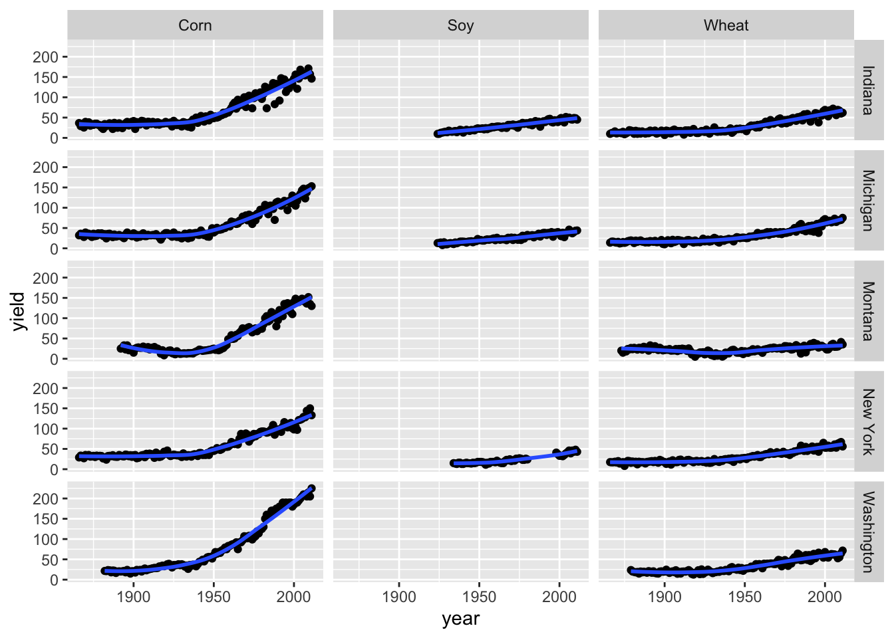
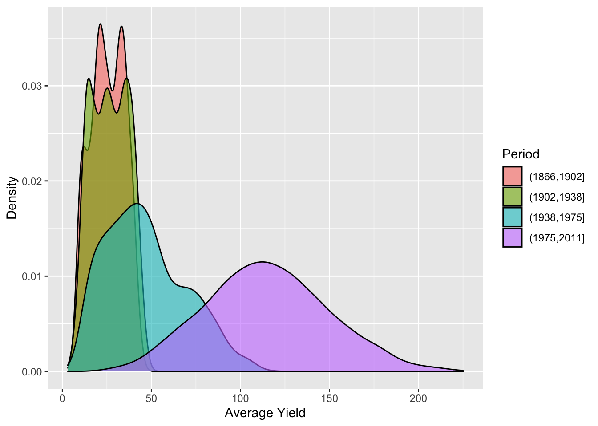
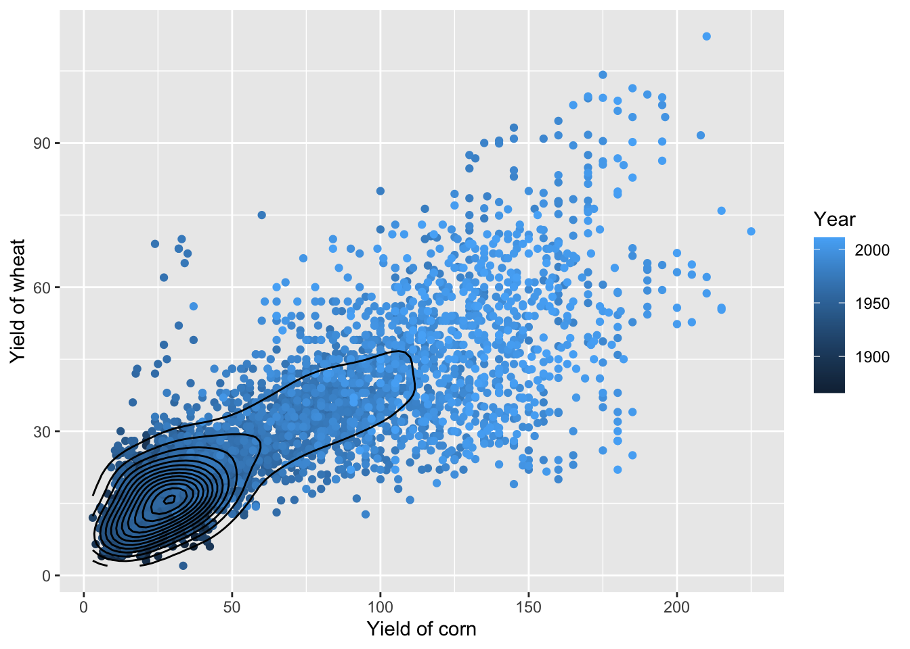
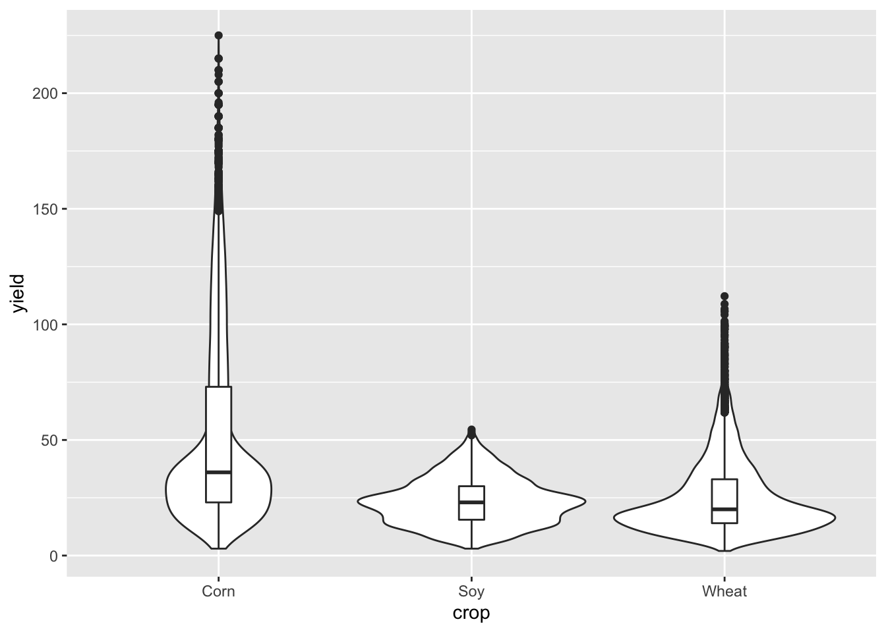
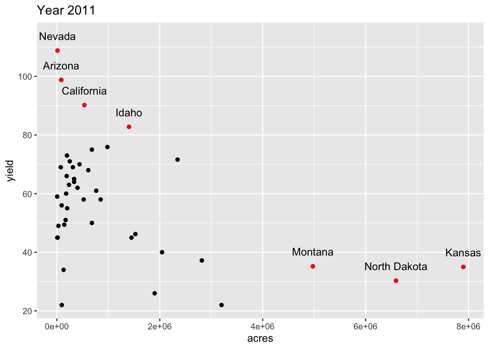
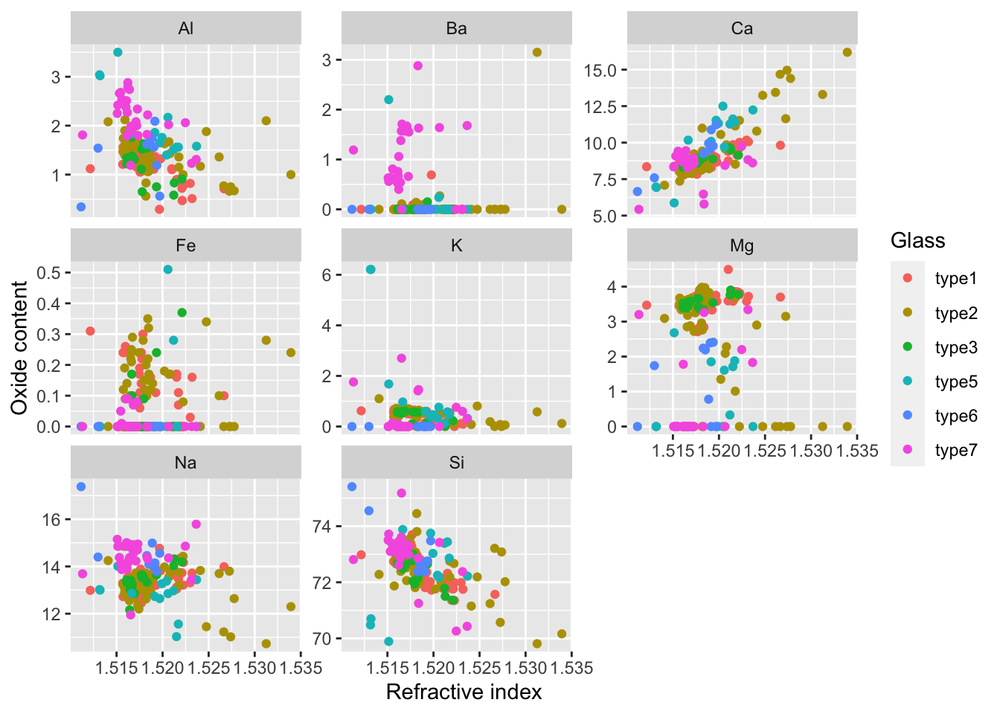
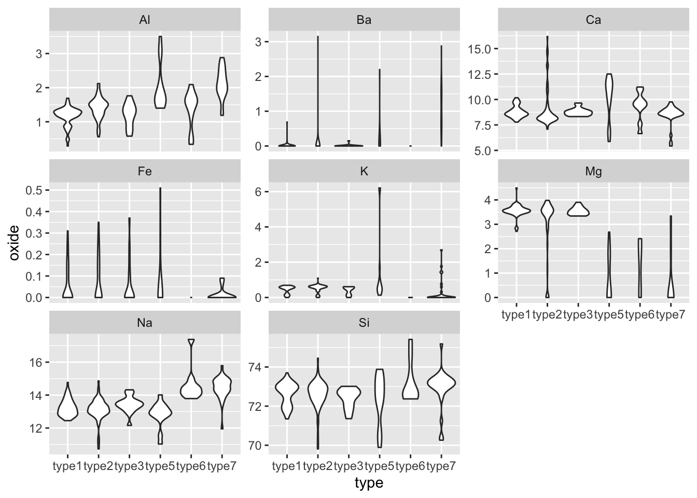
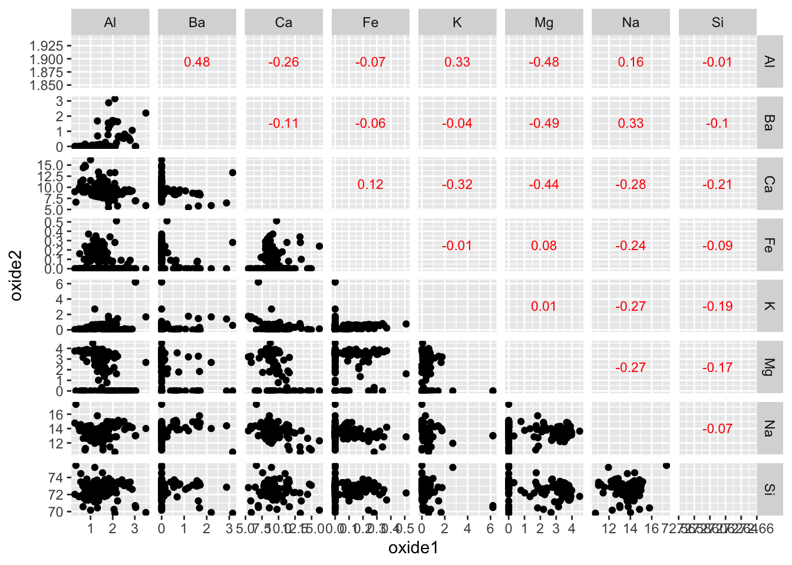
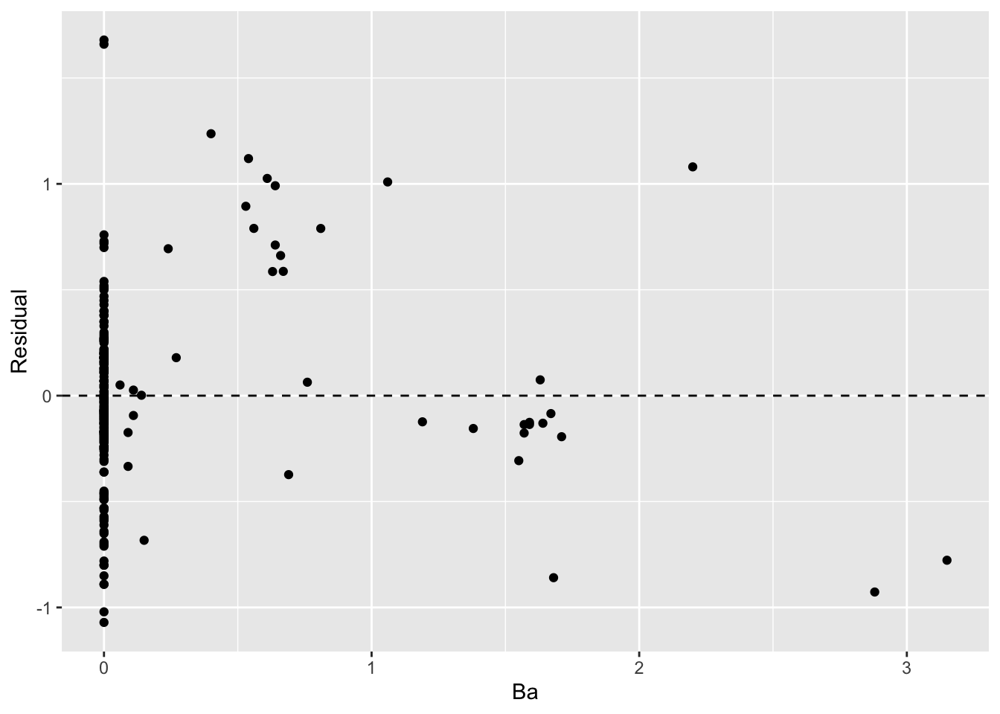

Push the `knit` button!


```{r setup, child="exercise-setup.Rmd"}
```
```{r pkgs, message = FALSE, warning = FALSE}
library(tidyverse) # contains ggplot2, dplyr, tidyr, etc
library(agridat) # for `nass.wheat`, `nass.corn`, `nass.soybean` datasets
library(catdata) # for `heart` data
```

## `nass.wheat`, `nass.corn`, `nass.soybean` dataset

```{r nass-data}
glimpse(nass.wheat)
glimpse(nass.corn)
glimpse(nass.soybean)
```

### Exercise 2.1

```{r day1-exercise-02-01, echo = F, class = "target"}

```

* Hint: the curve is the loess curve from `geom_smooth`

```{r day1-exercise-02-01s}
# add your code here!
```

### Exercise 2.2

```{r day1-exercise-02-02, echo = F, class = "target"}

```

* Hint: you can use the `cut` function to divide a numerical variable into intervals.

```{r day1-exercise-02-02s}
# add your code here!
```

### Exercise 2.3

```{r day1-exercise-02-03, echo = F, class = "target"}

```

* Hint: the density is plotted using `geom_density_2d`

```{r day1-exercise-02-03s}
# add your code here!
```

### Exercise 2.4

```{r day1-exercise-02-04, echo = F, class = "target"}

```

```{r day1-exercise-02-04s}
# add your code here!
```

### Exercise 2.5

```{r day1-exercise-02-05, echo = F, class = "target"}

```

* Note: this is the yield of wheat for year 2011.

```{r day1-exercise-02-05s}
# add your code here!
```

## `glass` dataset

```{r glass-data}
data("glass")
glimpse(glass)
```

### Exercise 2.6

```{r day1-exercise-02-06, echo = F, class = "target"}

```

* Remember that you can find more about the `glass` dataset after loaded by executing `?glass` in R.

```{r day1-exercise-02-06s}
# add your code here!
```

### Exercise 2.7

```{r day1-exercise-02-07, echo = F, class = "target"}

```

* You can reuse the wrangled data from Exercise 2.6.

```{r day1-exercise-02-07s}
# add your code here!
```

### Exercise 2.8


```{r day1-exercise-02-08, echo = F, class = "target"}

```

* This is a pairwise scatterplot in the lower triangle and upper triangle shows the pairwise correlation coefficient. 
* This is quite hard! There is an extension package (`GGally`) that does easily but try to challenge yourself without using it.

```{r day1-exercise-02-08s}
# add your code here!
```

### Exercise 2.9

```{r day1-exercise-02-09, echo = F, class = "target"}
knitr::include_graphics("images/day1-exercise-02/day1-exercise-09-1.png")
```

* This shows the QQ-plot of the residuals from the fit of a simple linear model `Al ~ Ba`.
* Note: you can use `broom::augment(lm(Al ~ Ba, data = glass))` to get a data frame with residuals easily. 

```{r day1-exercise-02-09s}
# add your code here!
```

### Exercise 2.10

```{r day1-exercise-02-10, echo = F, class = "target"}

```

* This is the residual plot from fit of a simple linear model `Al ~ Ba`.

```{r day1-exercise-02-10s}
# add your code here!
```
