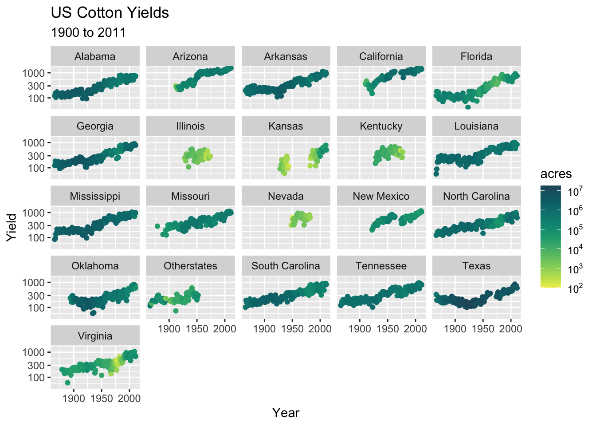
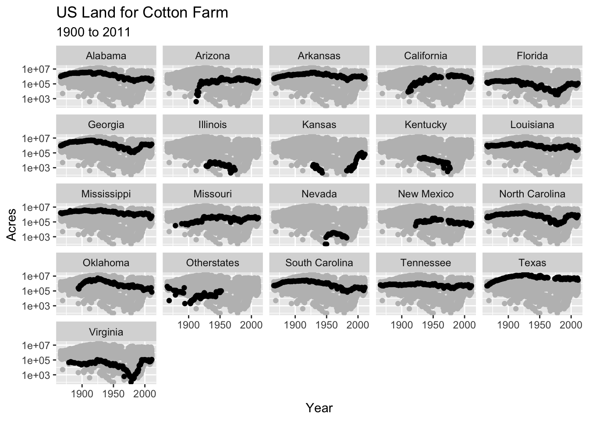
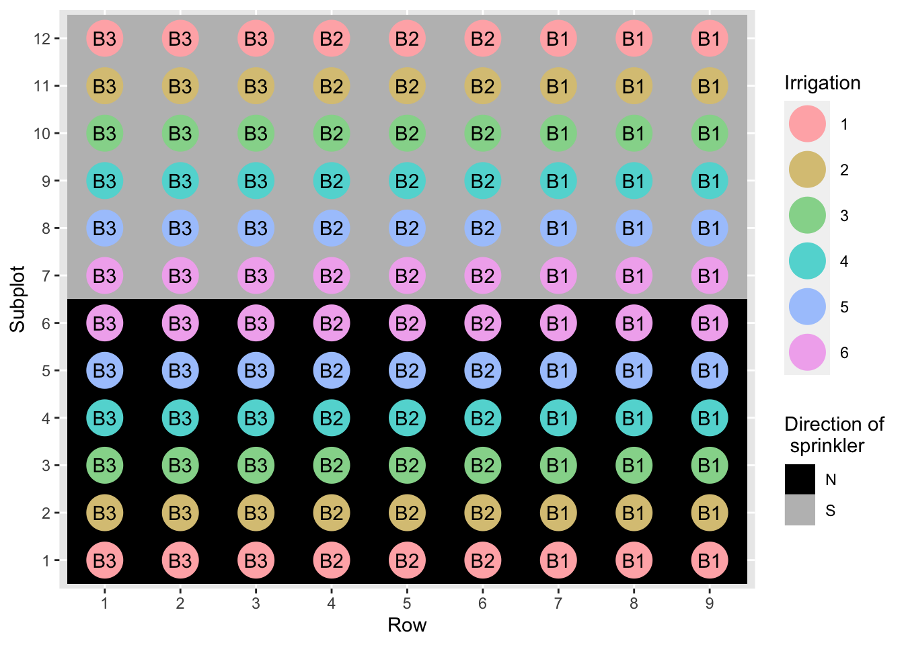
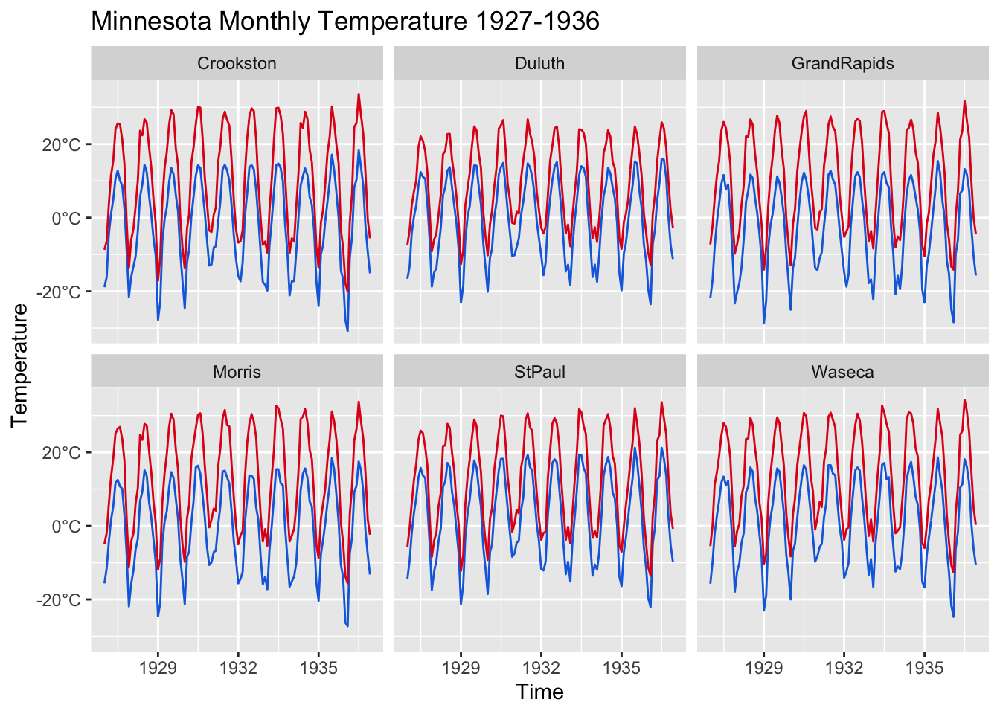

Push the `knit` button!


```{r setup, child="exercise-setup.Rmd"}
```
```{r pkgs, message = FALSE, warning = FALSE}
library(tidyverse) # contains ggplot2, dplyr, tidyr, etc
library(scales)
library(colorspace)
library(agridat) # for datasets
```

## `nass.cotton` dataset

```{r nass-data}
glimpse(nass.cotton)
```

### Exercise 3.1

```{r day1-exercise-03-01, echo = F, class = "target"}

```

* Note: the sequential palette is `ag_GrnYl` from `colorspace`.
* Note: look carefully at the format of the legend.

```{r day1-exercise-03-01s}
# add your code here!
```

### Exercise 3.2

```{r day1-exercise-03-02, echo = F, class = "target"}

```

```{r day1-exercise-03-02s}
# add your code here!
```

## `hazell.vegetables` dataset

```{r hazell-vegetables}
glimpse(hazell.vegetables)
```


### Exercise 3.3

```{r day1-exercise-03-03, echo = F, class = "target"}
knitr::include_graphics("images/day1-exercise-03/day1-exercise-03-1.png")
```

* Note: the color used is `#ff1a1a` are `#008000`.

```{r day1-exercise-03-03s}
# add your code here!
```

## `hanks.sprinkler` dataset

```{r hanks-sprinkler}
glimpse(hanks.sprinkler)
```


### Exercise 3.4

```{r day1-exercise-03-04, echo = F, class = "target"}

```

* Note that the color is using the qualitative palette `Set 3`.
* Note that the fill color is `black` and `gray`.
* You can change the order of appearance of legends by guides. Say `guides(color = guide_legend(order = 1))` to change `color` to appear first.

```{r day1-exercise-03-04s}
# add your code here!
```

## `minnesota.barley.weather` dataset

```{r minnesota.barley.weather}
glimpse(minnesota.barley.weather)
```

### Exercise 3.5

```{r day1-exercise-03-05, echo = F, class = "target"}

```

* The plot shows the maximum and minimum temperatures in Celsius over time by site.
* The line colors are `#166ee0` and `#e0161d`.

```{r day1-exercise-03-05s}
# add your code here!
```
