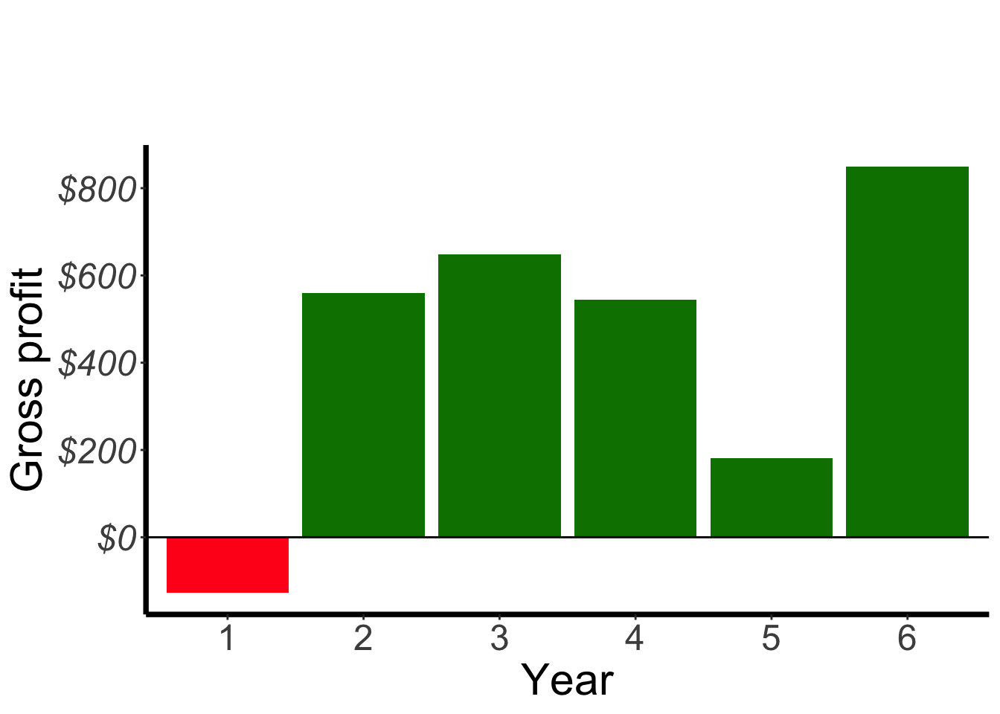
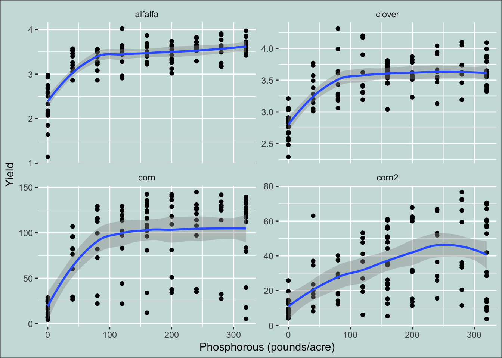
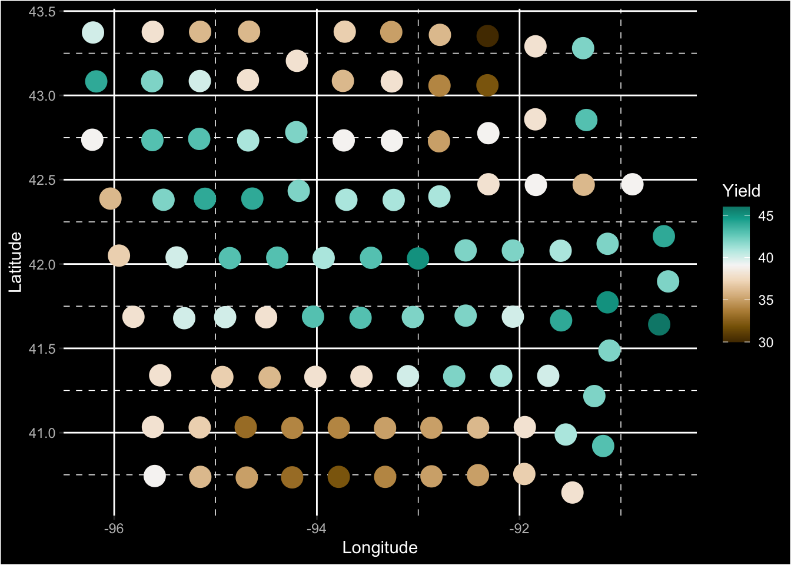

Push the `knit` button!


```{r setup, child="exercise-setup.Rmd"}
```
```{r pkgs, message = FALSE, warning = FALSE}
library(tidyverse) # contains ggplot2, dplyr, tidyr, etc
library(scales)
library(colorspace)
library(agridat) # for datasets
```

## `hazell.vegetables` dataset

```{r hazell-vegetables}
glimpse(hazell.vegetables)
```

### Exercise 4.1

```{r day1-exercise-04-01, echo = F, class = "target"}

```

* This is a jazzy plot version of Exercise 3.3 plot.

```{r day1-exercise-04-01s}
# add your code here!
```

## `heady.fertilizer` dataset

```{r heady-fertilizer}
glimpse(heady.fertilizer)
```

### Exercise 4.2

```{r day1-exercise-04-02, echo = F, class = "target"}

```

* The plot background color is `#CCDFDD`.

```{r day1-exercise-04-02s}
# add your code here!
```

## `wallace.iowaland` dataset

```{r wallace-iowaland}
glimpse(wallace.iowaland)
```


### Exercise 4.3

```{r day1-exercise-04-03, echo = F, class = "target"}

```

* Note: the diverging palette used is `Green-Brown` from `colorspace` with mid-point as average of the yield. 

```{r day1-exercise-04-03s}
# add your code here!
```
