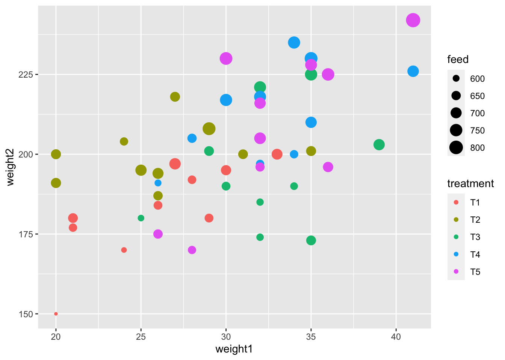
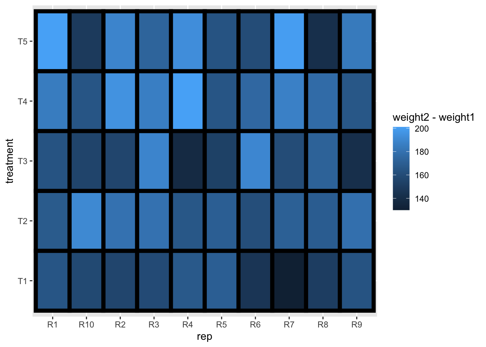
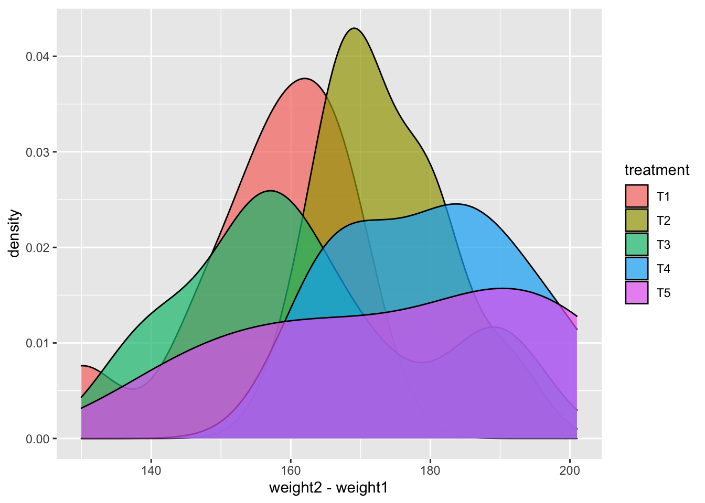
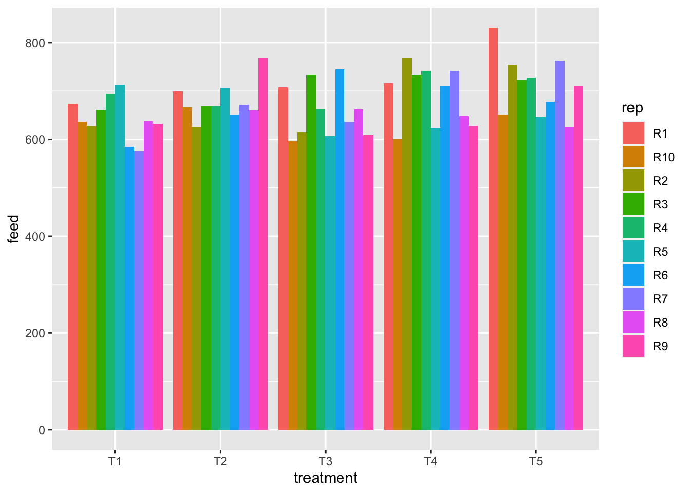
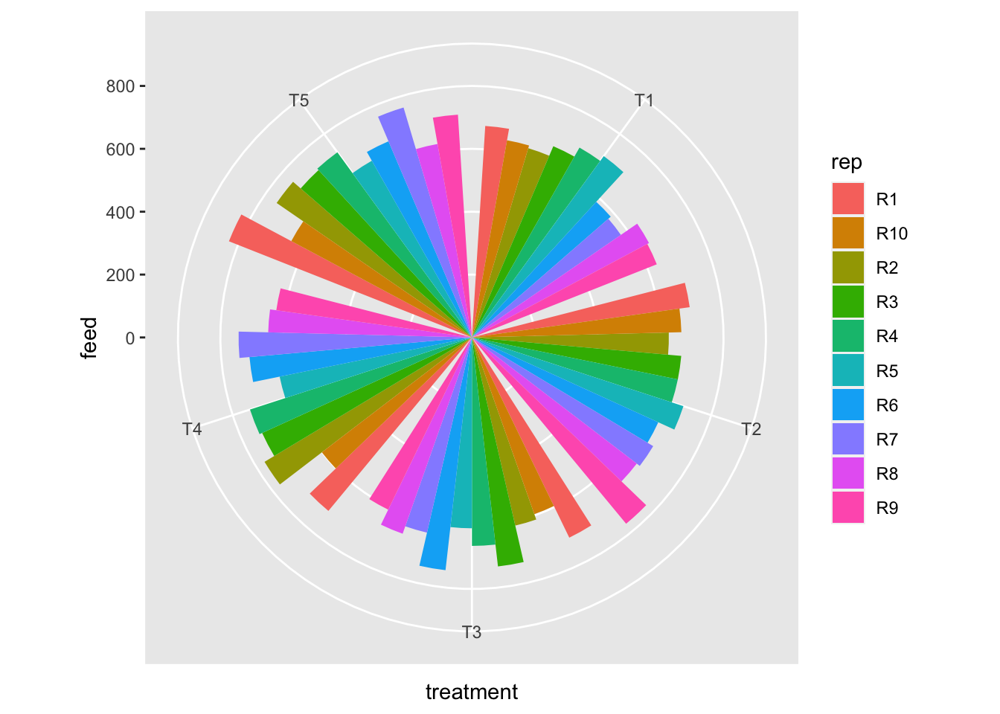
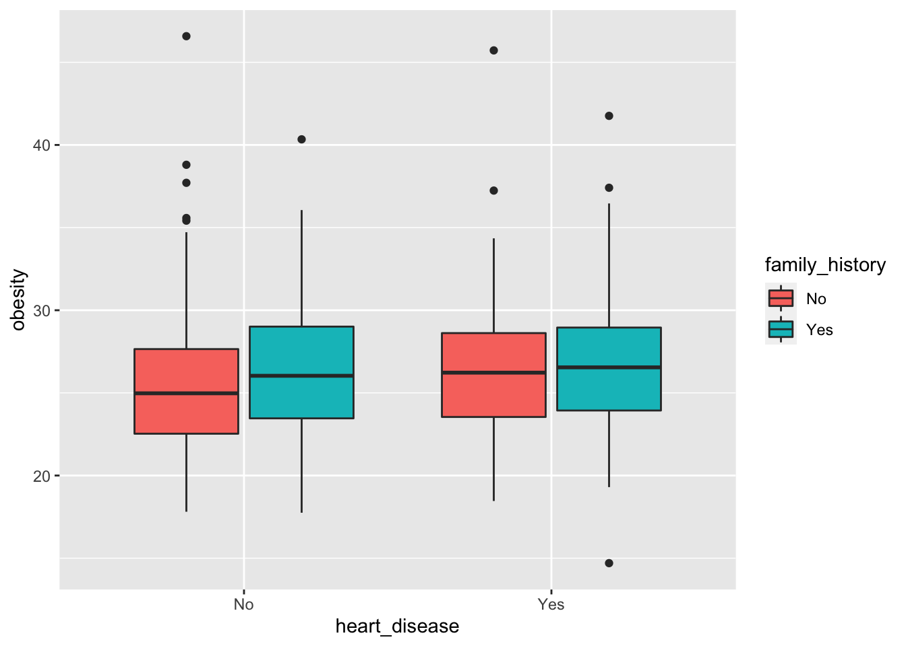
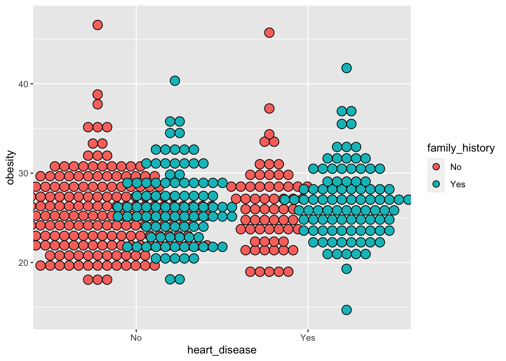
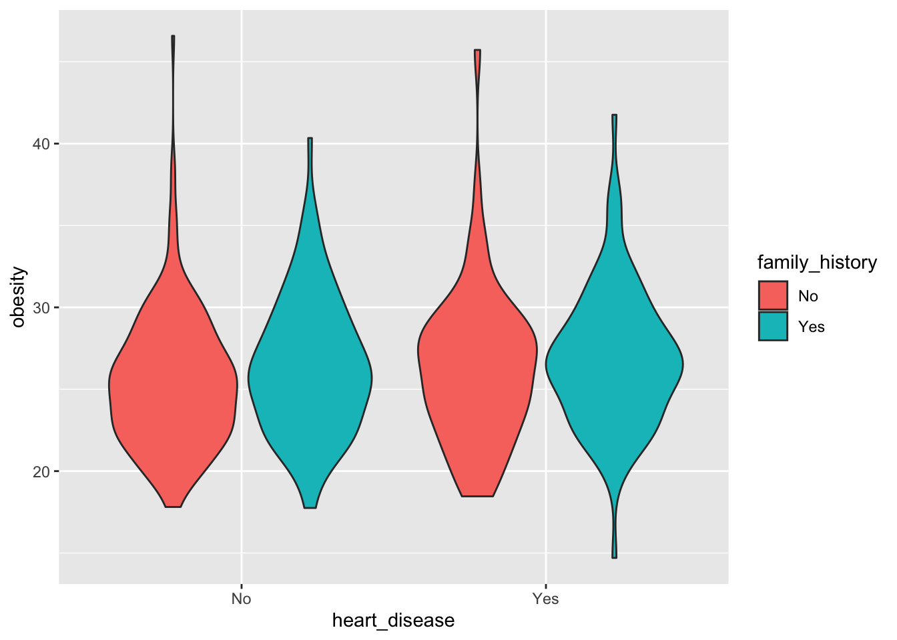
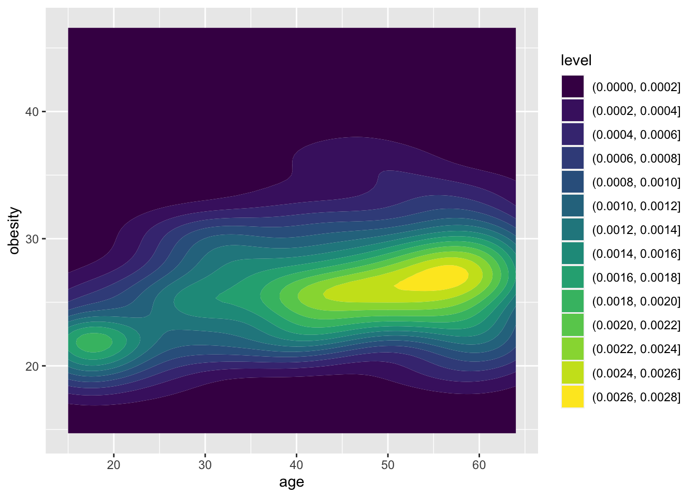
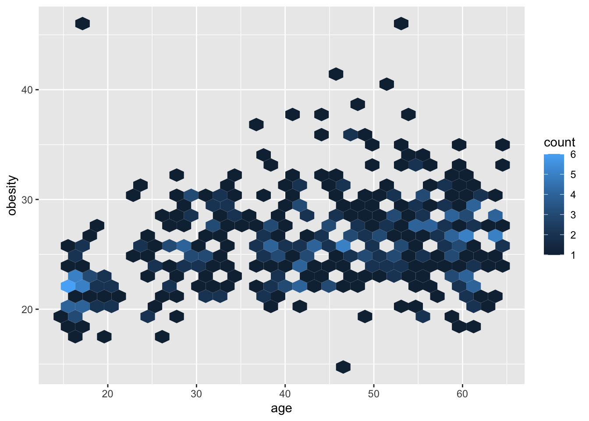

Push the `knit` button!


```{r setup, child="exercise-setup.Rmd", eval = file.exists("exercise-setup.Rmd")}
```

```{r pkgs, message = FALSE, warning = FALSE}
library(tidyverse) # contains ggplot2, dplyr, tidyr, etc
library(agridat) # for `crampton.pig` data
library(catdata) # for `heart` data
```

## `crampton.pig` dataset

```{r pig-data}
glimpse(crampton.pig)
```

### Exercise 1.1: Scatterplot

```{r part1-exercise-01-01, echo = F, class = "target"}

```

```{r part1-exercise-01-01s, eval = FALSE}
# fill all ... and change eval = FALSE to eval = TRUE when done
ggplot(crampton.pig, aes(weight1, weight2, color = ..., size = ...)) + 
  geom_point()
```


### Exercise 1.2: Tile plot

```{r part1-exercise-01-02, echo = F, class = "target"}

```

```{r part1-exercise-01-02s, eval = FALSE}
# fill all ... and change eval = FALSE to eval = TRUE when done
ggplot(crampton.pig, aes(..., ..., fill = ...)) + 
  geom_tile(color = "black", size = 2)
```

### Exercise 1.3: Density plot

```{r part1-exercise-01-03, echo = F, class = "target"}

```

```{r part1-exercise-01-03s, eval = FALSE}
# fill all ... and change eval = FALSE to eval = TRUE when done
ggplot(crampton.pig, aes(..., fill = ...)) + 
  geom_density(alpha = 0.7) 
```

### Exercise 1.4: Grouped barplot

```{r part1-exercise-01-04, echo = F, class = "target"}

```

```{r part1-exercise-01-04s, eval = FALSE}
# fill all ... and change eval = FALSE to eval = TRUE when done
ggplot(crampton.pig, aes(..., ..., fill = ...)) + 
  geom_col(position = "dodge")
```

### Exercise 1.5: Rose plot

```{r part1-exercise-01-05, echo = F, class = "target"}

```

```{r part1-exercise-01-05s, eval = FALSE}
# fill all ... and change eval = FALSE to eval = TRUE when done
ggplot(crampton.pig, aes(..., ..., fill = ...)) + 
  geom_col(position = "dodge") + coord_polar("x")
```

## `heart` dataset

```{r heart-data}
data("heart")
# cleaning a bit of the `heart` data
heart2 <- heart %>% 
  as_tibble(heart) %>% 
  mutate(family_history = ifelse(famhist==1, "Yes", "No"),
         heart_disease = ifelse(y==1, "Yes", "No"))

glimpse(heart2)
```

### Exercise 1.6: Boxplot

```{r part1-exercise-01-06, echo = F, class = "target"}

```

```{r part1-exercise-01-06s, eval = FALSE}
# fill all ... and change eval = FALSE to eval = TRUE when done
ggplot(heart2, aes(..., ..., fill = ...)) + 
  geom_boxplot()
```

### Exercise 1.7: Dotplot

```{r part1-exercise-01-07, echo = F, class = "target"}

```

```{r part1-exercise-01-07s, eval = FALSE}
# fill all ... and change eval = FALSE to eval = TRUE when done
ggplot(heart2, aes(..., ..., fill = ...)) + 
  geom_dotplot(binaxis = "y", stackdir = "center",
               position = "dodge")
```

### Exercise 1.8: Violin plot

```{r part1-exercise-01-08, echo = F, class = "target"}

```

```{r part1-exercise-01-08s, eval = FALSE}
# fill all ... and change eval = FALSE to eval = TRUE when done
ggplot(heart2, aes(..., ..., fill = ...)) + 
  geom_violin()
```

### Exercise 1.9: 2D density plot

```{r part1-exercise-01-09, echo = F, class = "target"}

```

```{r part1-exercise-01-09s, eval = FALSE}
# fill all ... and change eval = FALSE to eval = TRUE when done
ggplot(heart2, aes(..., ...)) + 
  geom_density_2d_filled()
```

### Exercise 1.10: Hexagonal heatmap

```{r part1-exercise-01-10, echo = F, class = "target"}

```

```{r part1-exercise-01-10s, eval = FALSE}
# fill all ... and change eval = FALSE to eval = TRUE when done
ggplot(heart2, aes(..., ...)) + 
  geom_hex()
```
