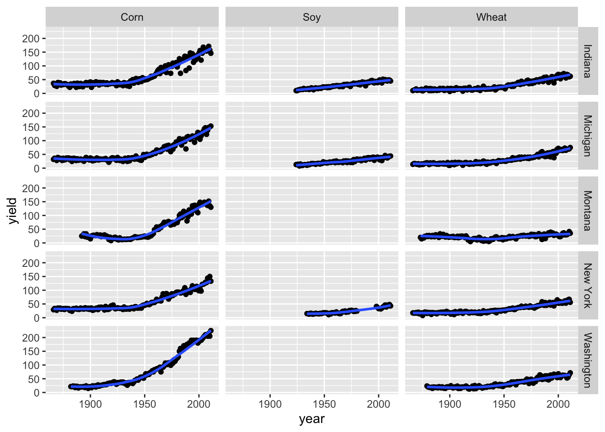
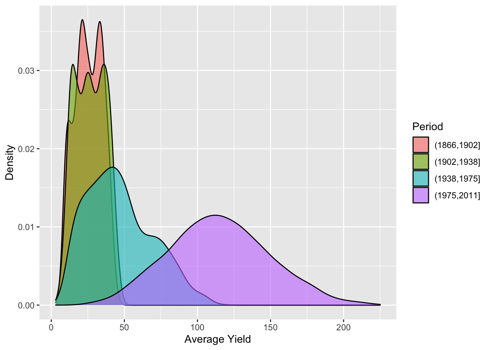
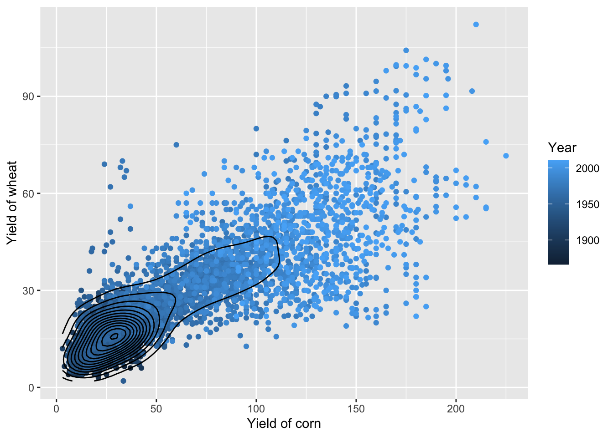
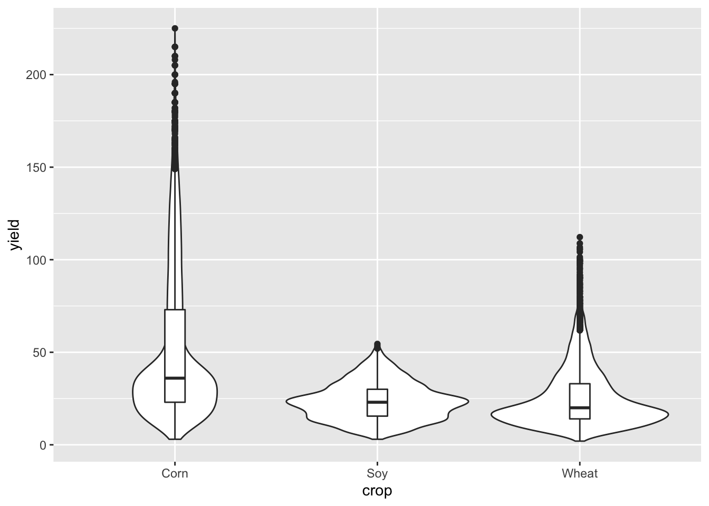
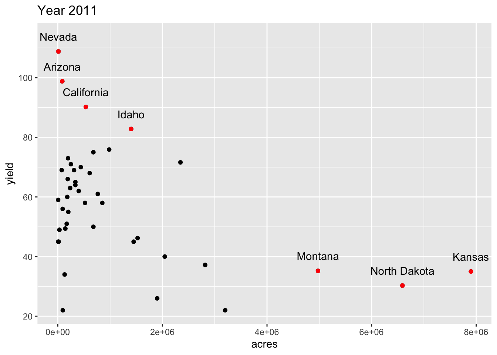
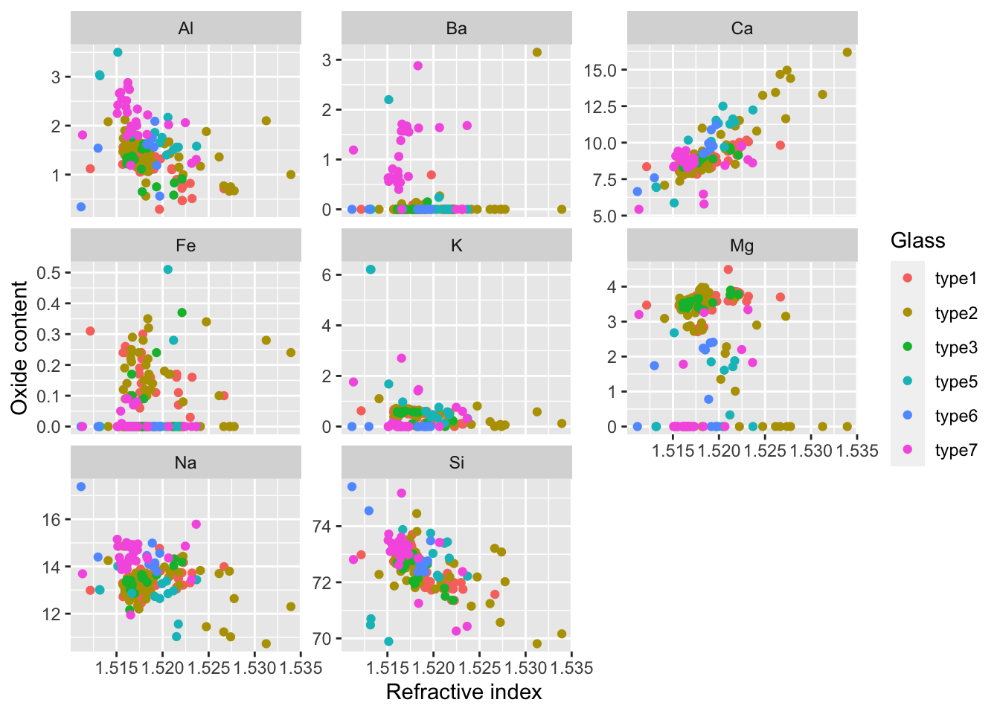
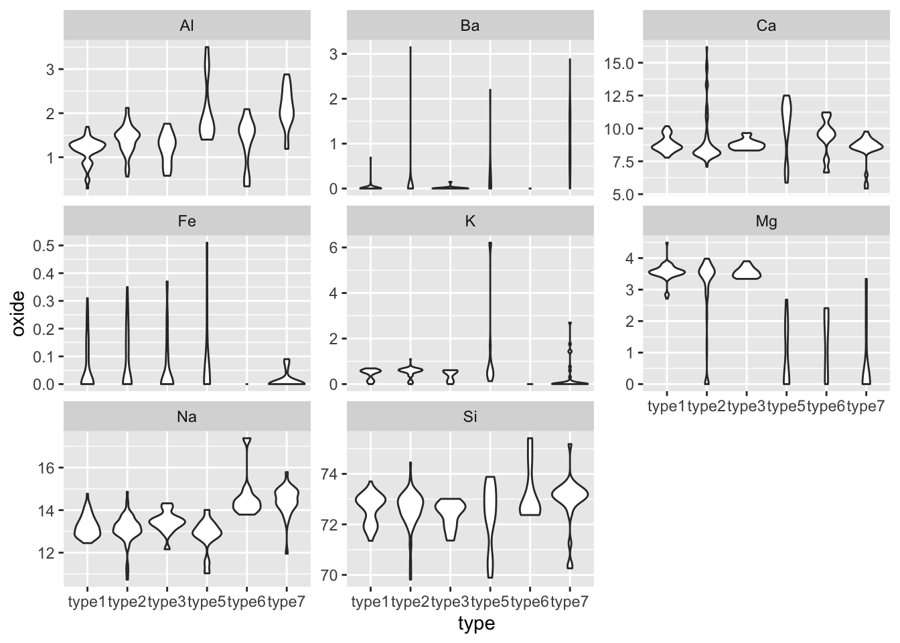
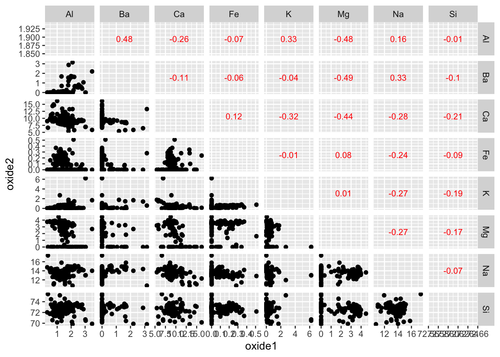
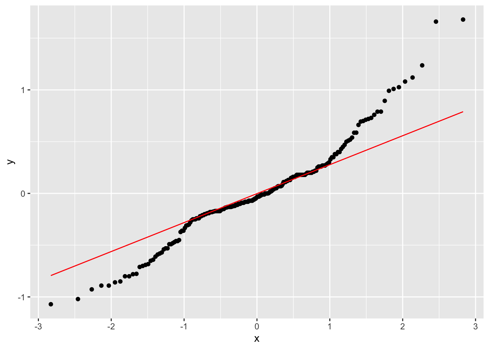
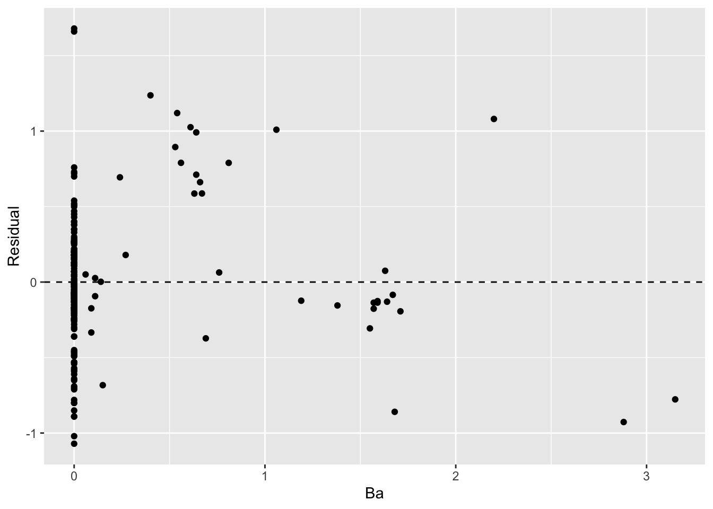

Push the `knit` button!


```{r setup, child="exercise-setup.Rmd", eval = file.exists("exercise-setup.Rmd")}
```

```{r pkgs, message = FALSE, warning = FALSE}
library(tidyverse) # contains ggplot2, dplyr, tidyr, etc
library(agridat) # for `nass.wheat`, `nass.corn`, `nass.soybean` datasets
library(catdata) # for `heart` data
```

## `nass.wheat`, `nass.corn`, `nass.soybean` dataset

```{r nass-data}
glimpse(nass.wheat)
glimpse(nass.corn)
glimpse(nass.soybean)
```

### Exercise 2.1

```{r part1-exercise-02-01, echo = F, class = "target"}

```

* Hint: the curve is the loess curve from `geom_smooth`

```{r part1-exercise-02-01s, eval = FALSE}
# fill all ... and change eval = FALSE to eval = TRUE when done

df <- bind_rows(mutate(nass.wheat, crop = "Wheat"),
                mutate(nass.corn, crop = "Corn"),
                mutate(nass.soybean, crop = "Soy")) %>% 
  filter(state %in% c("New York", "Michigan", "Indiana", "Montana", "Washington"))

ggplot(df, aes(..., ...)) + 
  geom_...() + 
  ...() + 
  facet_grid(... ~ ...)
```

### Exercise 2.2

```{r part1-exercise-02-02, echo = F, class = "target"}

```

* This is using `nass.corn` data.
* Hint: you can use the `cut` function to divide a numerical variable into intervals.


```{r part1-exercise-02-02s, eval = FALSE}
# fill all ... and change eval = FALSE to eval = TRUE when done
ggplot(nass.corn, aes(..., fill = cut(..., 4, dig.lab = 4))) + 
  geom_...(alpha = 0.6) +
  labs(fill = "Period", x = "Average Yield", y = "Density")
```

### Exercise 2.3

```{r part1-exercise-02-03, echo = F, class = "target"}

```

* Hint: the density is plotted using `geom_density_2d`

```{r part1-exercise-02-03s, eval = FALSE}
# fill all ... and change eval = FALSE to eval = TRUE when done
df2 <- left_join(rename(nass.wheat, 
                        yield_wheat = yield, acres_wheat = acres), 
                 rename(nass.corn, 
                        yield_corn = yield, acres_corn = acres),
                 by = c("year", "state"))

ggplot(df2, aes(..., ...)) + 
  geom_...(aes(color = ...)) +
  geom_density_2d(color = "black") + 
  labs(x = "Yield of corn", y = "Yield of wheat", color = "Year")
```

### Exercise 2.4

```{r part1-exercise-02-04, echo = F, class = "target"}

```

```{r part1-exercise-02-04s, eval = FALSE}
# fill all ... and change eval = FALSE to eval = TRUE when done
df3 <- bind_rows(mutate(nass.wheat, crop = "Wheat"),
                mutate(nass.corn, crop = "Corn"),
                mutate(nass.soybean, crop = "Soy")) 

ggplot(df3, aes(..., ...)) + 
  geom_...() + 
  geom_...(width = 0.1)
```

### Exercise 2.5

```{r part1-exercise-02-05, echo = F, class = "target"}

```

* Note: this is the yield of wheat for year 2011.

```{r part1-exercise-02-05s, eval = FALSE}
# fill all ... and change eval = FALSE to eval = TRUE when done
df4 <- nass.wheat %>% 
  filter(year == 2011) 
df4highlight <- filter(df4, acres > 4000000 | yield > 80)

ggplot(df4, aes(..., yield)) + 
  ...() + 
  ...(data = df4highlight, color = "red") + 
  geom_text(data = df4highlight, aes(label = ...), nudge_y = 5) +
  ggtitle("Year 2011")
```

## `glass` dataset

```{r glass-data}
data("glass")
glimpse(glass)
```

### Exercise 2.6

```{r part1-exercise-02-06, echo = F, class = "target"}

```

* Remember that you can find more about the `glass` dataset after loaded by executing `?glass` in R.

```{r part1-exercise-02-06s, eval = FALSE}
# fill all ... and change eval = FALSE to eval = TRUE when done
df5 <- glass %>% 
  mutate(id = paste0("glass", 1:n())) %>% 
  pivot_longer(-c(RI, type, id), names_to = "element", values_to = "oxide")

ggplot(df5, aes(..., ...)) + 
  geom_point(aes(color = ...)) + 
  facet_wrap(~..., scale = "free_y") + 
  labs(x = "Refractive index", y = "Oxide content", color = "Glass")

```

### Exercise 2.7

```{r part1-exercise-02-07, echo = F, class = "target"}

```

* You can reuse the wrangled data from Exercise 2.6.

```{r part1-exercise-02-07s, eval = FALSE}
# fill all ... and change eval = FALSE to eval = TRUE when done
ggplot(df5, aes(..., ...)) + 
  geom_...() + 
  facet_wrap(~..., scale = "free_y")
```

### Exercise 2.8


```{r part1-exercise-02-08, echo = F, class = "target"}

```

* This is a pairwise scatterplot in the lower triangle and upper triangle shows the pairwise correlation coefficient. 
* This is quite hard! There is an extension package (`GGally`) that does easily but try to challenge yourself without using it.

```{r part1-exercise-02-08s, eval = FALSE}
# fill all ... and change eval = FALSE to eval = TRUE when done
elements <- sort(c("Na", "Mg", "Al", "Si", "K", "Ca", "Ba", "Fe"))
nele <- length(elements)
# this uses `purrr` but many other ways to do this
# below is like using is two for loops, 
# but `purrrr::map_dfr` ensures the return type is data frame appended by row
df6 <- map_dfr(1:(nele - 1),  
               function(i) {
                 map_dfr((i + 1):nele, function(j) {
                   ele1 <- elements[i]
                   ele2 <- elements[j]
                   mutate(glass, 
                          element1 = ele1, element2 = ele2, 
                          oxide1 = glass[[ele1]], oxide2 = glass[[ele2]]) %>% 
                   select(RI, type, oxide1, oxide2, element1, element2)
                })}) 

cordat <- cor(select(glass, all_of(elements))) %>% 
  as_tibble() %>% 
  mutate(element1 = colnames(.)) %>% 
  pivot_longer(-element1, 
               names_to = "element2",
               values_to = "cor") %>% 
  mutate(i1 = as.integer(factor(element1)),
         i2 = as.integer(factor(element2))) %>% 
  filter(i1 > i2) %>% 
  # get the center points
  rowwise() %>% 
  mutate(oxide1 = mean(range(glass[[element1]])),
         oxide2 = mean(range(glass[[element2]])))

# also check out `GGally::ggpairs(select(glass, all_of(elements)))`
  
ggplot(df6, aes(..., ...)) + 
  geom_point() + 
  # remember formula is y ~ x
  facet_grid(... ~ ..., scales = "free") +
  geom_text(data = cordat, aes(label = round(cor, 2)), color = "red", size = 3)

```

### Exercise 2.9

```{r part1-exercise-02-09, echo = F, class = "target"}

```

* This shows the QQ-plot of the residuals from the fit of a simple linear model `Al ~ Ba`.
* Note: you can use `broom::augment(lm(Al ~ Ba, data = glass))` to get a data frame with residuals easily. 

```{r part1-exercise-02-09s, eval = FALSE}
# fill all ... and change eval = FALSE to eval = TRUE when done
fit <- lm(Al ~ Ba, data = glass) %>% 
  broom::augment()
ggplot(fit, aes(sample = ...)) + 
  geom_qq() + 
  geom_qq_line(color = "red")
```

### Exercise 2.10

```{r part1-exercise-02-10, echo = F, class = "target"}

```

* This is the residual plot from fit of a simple linear model `Al ~ Ba`.

```{r part1-exercise-02-10s, eval = FALSE}
# fill all ... and change eval = FALSE to eval = TRUE when done
ggplot(fit, aes(Ba, .resid)) + 
  geom_...(yintercept = 0, linetype = "dashed") +
  ...() +
  ...(y = "Residual")
```
