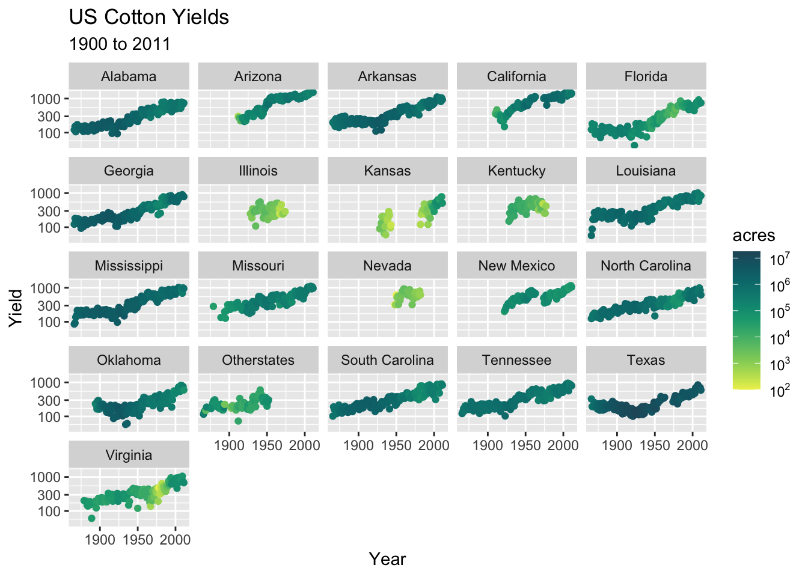
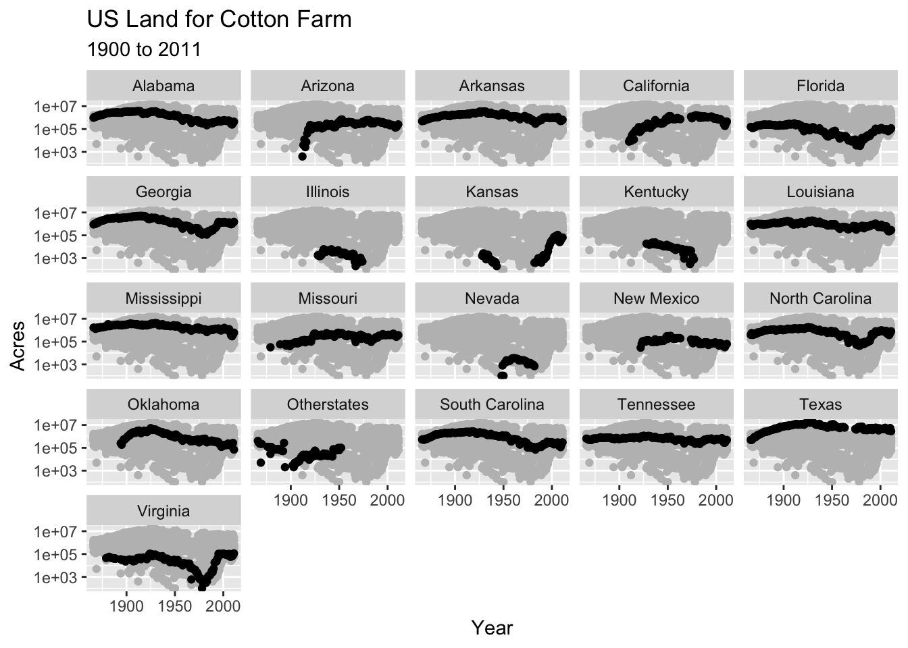
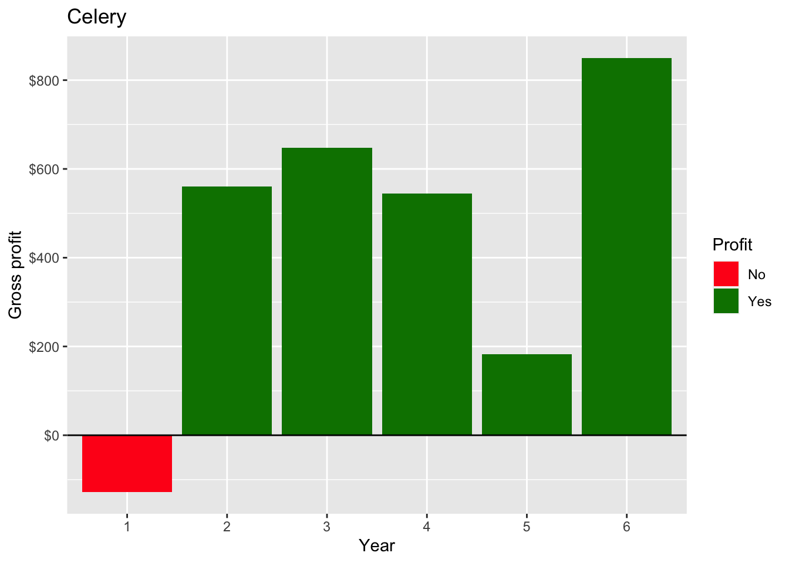
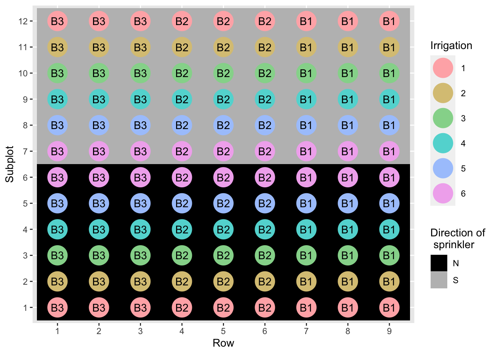
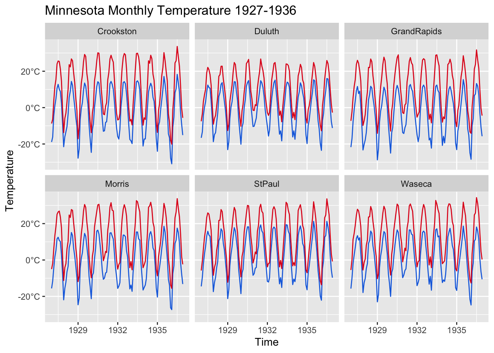

Push the `knit` button!


```{r setup, child="exercise-setup.Rmd", eval = file.exists("exercise-setup.Rmd")}
```
```{r pkgs, message = FALSE, warning = FALSE}
library(tidyverse) # contains ggplot2, dplyr, tidyr, etc
library(scales)
library(colorspace)
library(agridat) # for datasets
```

## `nass.cotton` dataset

```{r nass-data}
glimpse(nass.cotton)
```

### Exercise 3.1

```{r part1-exercise-03-01, echo = F, class = "target"}

```

* Note: the sequential palette is `ag_GrnYl` from `colorspace`.
* Note: look carefully at the format of the legend.

```{r part1-exercise-03-01s, eval = FALSE}
# fill all ... and change eval = FALSE to eval = TRUE when done
ggplot(nass.cotton, aes(year, yield)) + 
  geom_...(aes(color = ...)) + 
  facet_wrap(~...) + 
  scale_y_...(name = "Yield") + 
  scale_color_continuous_sequential(palette = "ag_GrnYl",
                                    trans = "log10",
                                    breaks = trans_breaks("log10", function(x) 10^x),
                                    labels = trans_format("log10", math_format(10.^.x))) +
  labs(x = "Year", title = "US Cotton Yields", subtitle = "1900 to 2011") 
```

### Exercise 3.2

```{r part1-exercise-03-02, echo = F, class = "target"}

```

```{r part1-exercise-03-02s, eval = FALSE}
# fill all ... and change eval = FALSE to eval = TRUE when done

# drop the state so it doesn't get facet wrapped
shadow_dat <- nass.cotton %>% mutate(state = NULL) 
ggplot(nass.cotton, aes(..., ...)) +
  geom_point(data = shadow_dat, color = "gray") +
  geom_point() +
  facet_wrap(~...) + 
  scale_y_log10() + 
  labs(...)

```

## `hazell.vegetables` dataset

```{r hazell-vegetables}
glimpse(hazell.vegetables)
```


### Exercise 3.3

```{r part1-exercise-03-03, echo = F, class = "target"}

```

```{r part1-exercise-03-03s, eval = FALSE}
# fill all ... and change eval = FALSE to eval = TRUE when done
ggplot(hazell.vegetables, aes(year, celery, fill = celery > 0)) + 
  geom_...() + 
  geom_...(yintercept = 0) + 
  scale_...(labels = dollar) + 
  labs(y = "Gross profit", x = "Year",
       title = "Celery", fill = "Profit") +
  scale_fill_manual(labels = c("No", "Yes"),
                    values = c("#ff1a1a", "#008000")) +
  scale_x_...(labels = 1:6)
```

## `hanks.sprinkler` dataset

```{r hanks-sprinkler}
glimpse(hanks.sprinkler)
```


### Exercise 3.4

```{r part1-exercise-03-04, echo = F, class = "target"}

```

* You can change the order of appearance of legends by guides. Say `guides(color = guide_legend(order = 1))` to change `color` to appear first.

```{r part1-exercise-03-04s, eval = FALSE}
# fill all ... and change eval = FALSE to eval = TRUE when done
ggplot(hanks.sprinkler, aes(factor(row), factor(subplot))) +
  ...(aes(fill = dir)) +
  ...(aes(color = factor(irr)), size = 9) +
  ...(aes(label = block)) +
  ...(values = c("black", "gray"), 
                    name = "Direction of\n sprinkler") + 
  scale_color_discrete_qualitative(palette = "Set 3") +
  ...(x = "Row", y = "Subplot", color = "Irrigation") + 
  # so that color legend appears before the fill legend
  guides(fill = guide_legend(order = 2),
         color = guide_legend(order = 1))
```

## `minnesota.barley.weather` dataset

```{r minnesota.barley.weather}
glimpse(minnesota.barley.weather)
```

### Exercise 3.5

```{r part1-exercise-03-05, echo = F, class = "target"}

```

* The plot shows the maximum and minimum temperatures in Celsius over time by site.
* The line colors are `#166ee0` and `#e0161d`.

```{r part1-exercise-03-05s, eval = FALSE}
# fill all ... and change eval = FALSE to eval = TRUE when done
df <- minnesota.barley.weather %>% 
  mutate(date = as.Date(paste(year, mo, "01", sep = "-")))
  
farenheight_to_celsius <- function(x) return((x - 32) * 5/9) 

ggplot(df, aes(x = ...)) + 
  ...(aes(y = farenheight_to_celsius(min)), color = "#166ee0") + 
  ...(aes(y = farenheight_to_celsius(max)), color = "#e0161d")  + 
  facet_wrap(~site) + 
  ...(name = "Temperature",
                     label = function(x) paste0(x, "°C")) +
  scale_x_date(breaks = scales::date_breaks(width = "3 year"),
               date_labels = "%Y",
               name = "Time")  +
  ggtitle("Minnesota Monthly Temperature 1927-1936")

```
