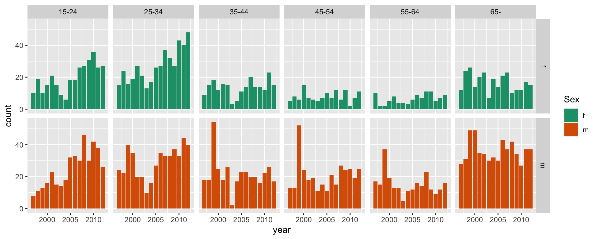

Push the `knit` button!


```{r setup, child="exercise-setup.Rmd", eval = file.exists("exercise-setup.Rmd")}
```

```{r, include = FALSE}
knitr::opts_chunk$set(
  message = FALSE,
  error = FALSE,
  warning = FALSE
  )
```

```{r pkgs, message = FALSE, warning = FALSE}
library(tidyverse) # contains ggplot2, dplyr, tidyr, etc
```

## `tuberculosis` dataset

```{r tb-data}
tb <- read_csv(here::here("data/TB_notifications_2020-07-01.csv")) %>% 
  dplyr::select(country, iso3, year, new_sp_m04:new_sp_fu) %>%
  pivot_longer(cols=new_sp_m04:new_sp_fu, names_to="sexage", values_to="count") %>%
  mutate(sexage = str_replace(sexage, "new_sp_", "")) %>%
  mutate(sex=substr(sexage, 1, 1), 
         age=substr(sexage, 2, length(sexage))) %>%
  dplyr::select(-sexage) %>%
  filter(!(age %in% c("04", "014", "514", "u"))) %>%
  filter(year > 1996, year < 2013) %>%
  mutate(age_group = factor(age, 
                            labels = c("15-24", "25-34", "35-44", 
                                       "45-54", "55-64", "65-"))) %>%
  dplyr::select(country, year, age_group, sex, count)

# Filter Australia
tb_oz <- tb %>% 
  filter(country == "Australia") 
```

### Exercise 1.1: Stacked bar chart

```{r part2-exercise-01-01, echo = F, class = "target"}

```

```{r part2-exercise-01-01s}
# add your code here!
```

### Exercise 1.2: Side-by-side bar chart

```{r part2-exercise-01-02, echo = F, class = "target"}

```

```{r part2-exercise-01-02s}
# add your code here!
```

### Exercise 1.3: Facetted bar chart

```{r part2-exercise-01-03, echo = F, class = "target"}

```

```{r part2-exercise-01-03s}
# add your code here!
```

### Exercise 1.4: Facetted bar chart for 2012

```{r part2-exercise-01-04, echo = F, class = "target"}

```

```{r part2-exercise-01-04s}
# add your code here!
```

### Exercise 1.5: Reverse facetted bar chart for 2012

```{r part2-exercise-01-05, echo = F, class = "target"}

```

```{r part2-exercise-01-05s}
# add your code here!
```

### Exercise 1.6: Facetted pie chart for 2012

```{r part2-exercise-01-06, echo = F, class = "target"}

```

```{r part2-exercise-01-06s}
# add your code here!
```

### Exercise 1.7: Reverse facetted pie chart for 2012

```{r part2-exercise-01-07, echo = F, class = "target"}

```

```{r part2-exercise-01-07s}
# add your code here!
```

### Exercise 1.8: Aggregated count bar chart

```{r part2-exercise-01-08, echo = F, class = "target"}
knitr::include_graphics("images/part2-exercise-01/part2-exercise-08-1.png")
```

```{r part2-exercise-01-08s}
# add your code here!
```

### Exercise 1.9: Showing proportions

```{r part2-exercise-01-09, echo = F, class = "target"}

```

```{r part2-exercise-01-09s}
# add your code here!
```

### Exercise 1.10: Overlaying a model

```{r part2-exercise-01-10, echo = F, class = "target"}

```

```{r part2-exercise-01-10s}
# add your code here!
```
