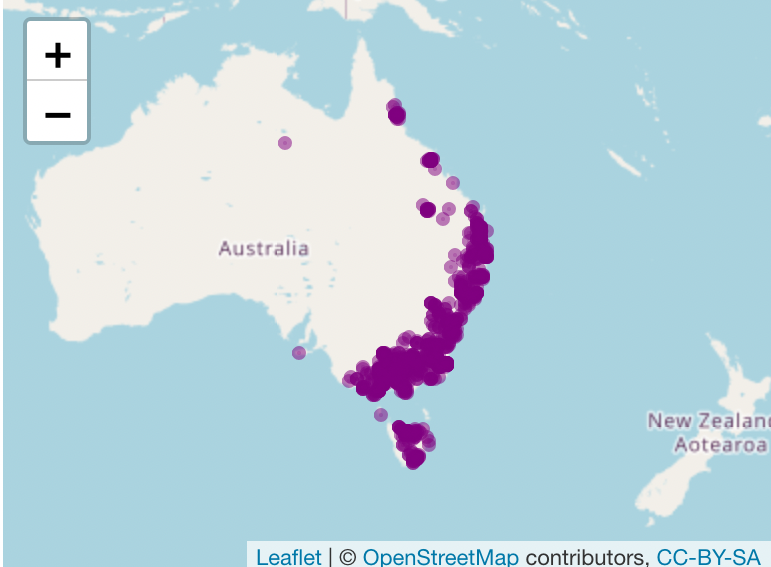
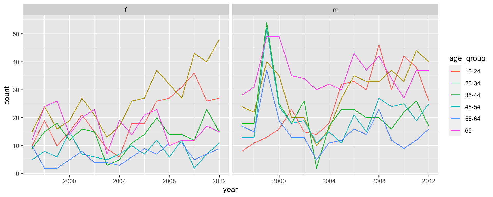
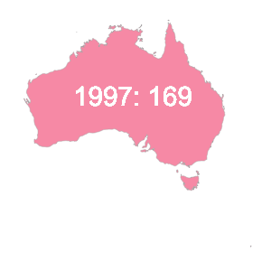

Push the `knit` button!


```{r setup, child="exercise-setup.Rmd", eval = file.exists("exercise-setup.Rmd")}
```

```{r, include = FALSE}
knitr::opts_chunk$set(
  message = FALSE,
  error = FALSE,
  warning = FALSE
  )
```

```{r pkgs, message = FALSE, warning = FALSE}
library(tidyverse) # contains ggplot2, dplyr, tidyr, etc
library(leaflet)
library(lubridate)
library(plotly)
library(gganimate)
library(ggthemes)
```

## `tuberculosis` dataset

```{r tb-data}
tb <- read_csv(here::here("data/TB_notifications_2020-07-01.csv")) %>% 
  dplyr::select(country, iso3, year, new_sp_m04:new_sp_fu) %>%
  pivot_longer(cols=new_sp_m04:new_sp_fu, names_to="sexage", values_to="count") %>%
  mutate(sexage = str_replace(sexage, "new_sp_", "")) %>%
  mutate(sex=substr(sexage, 1, 1), 
         age=substr(sexage, 2, length(sexage))) %>%
  dplyr::select(-sexage) %>%
  filter(!(age %in% c("04", "014", "514", "u"))) %>%
  filter(year > 1996, year < 2013) %>%
  mutate(age_group = factor(age, 
                            labels = c("15-24", "25-34", "35-44", 
                                       "45-54", "55-64", "65-"))) %>%
  dplyr::select(country, year, age_group, sex, count)

# Filter Australia
tb_oz <- tb %>% 
  filter(country == "Australia") 

# Aggregate Australian counts by year
tb_oz_yearly <- tb_oz %>%
  group_by(country, year) %>%
  summarise(count = sum(count))
```

## `platypus` dataset

```{r platypus}
load(here::here("data/platypus.rda")) 
platypus <- platypus %>%
  mutate(year = year(eventDate)) %>%
  filter(year > 2018) 
```

### Exercise 3.1: Leaflet with different colour

```{r part2-exercise-03-01, echo = F, class = "target"}

```

```{r part2-exercise-03-01s}
# add your code here!
```

### Exercise 3.2: Change the color palette

Add colour to plotly highlighting 

Remember this code:

```{r eval=FALSE}
tb_action <- highlight_key(tb_oz, ~age_group)

p2 <- ggplot(tb_action, aes(x=year, y=count)) +
  geom_line(aes(group=age_group)) +
  geom_smooth() + 
  facet_wrap(~sex)  

gg <- ggplotly(p2, height = 300, width = 600) %>%
   layout(title = "Click on a line to highlight an age group")

highlight(gg)
```

Use this  plot as the base, and check highlighting still works

```{r part2-exercise-03-02, echo = F, class = "target"}

```

```{r part2-exercise-03-02s}
# add your code here!
```

### Exercise 3.3: Animate TB counts for Australia on a map


```{r part2-exercise-03-03, echo = F, class = "target"}

```

```{r part2-exercise-03-03s}
# add your code here!
```

