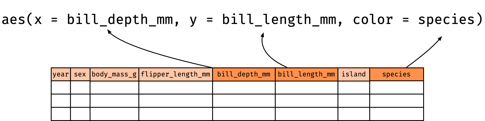

```{r, include = FALSE}
current_file <- knitr::current_input()
```
```{r titleslide, child="assets/titleslide.Rmd"}
```
```{r, include = FALSE}
knitr::opts_chunk$set(
  fig.path = "images/day1-session1/",
  warning = FALSE,
  message = FALSE
)
library(tidyverse)
filter <- dplyr::filter

df <- tribble(     ~duty, ~perc,
              "Teaching",    40,
              "Research",    40,
                 "Admin",    20) 
```


---

class: transition middle

# <i class="fas fa-key"></i> Why grammar of graphics for data visualisation?


---

name: base-graphics

class: font_smaller

# <i class="fas fa-chart-bar"></i> Constructing plots with R: `base` version

.grid[
.item.border-right[
```{r data}
df
```

[.tag[<i class="fas fa-caret-right"></i> `ggplot2` version]](#ggplot-graphics)

]
.item.border-right[
Stacked barplot
```{r barplot, echo = TRUE, fig.width = 5, fig.height = 6}
barplot(as.matrix(df$perc),
        legend = df$duty)
```


]
.item[
Pie chart
```{r pie, echo = TRUE, fig.width = 5}
pie(df$perc, labels = df$duty)
```


]
]

.footnote[
R Core Team (2020) R: A Language and Environment for Statistical Computing https://www.R-project.org/
]

--

.corner-box[

* **Single purpose functions** to generate "named plots"
* **Input** varies, here it is vector or matrix

]


---

name: graphics-question

.grid[
.item.center[

<br>
How are **barplots** different to a **pie chart**? 🤔


```{r unstacked-barplot, echo = FALSE, fig.height = 5, fig.width = 5}
barplot(df$perc, names.arg = df$duty)
```

Don't they all **depict the same information**? 🤨


]
.item.center[

```{r barplot, echo = FALSE, fig.height = 5, fig.width = 5}
```
```{r pie, echo = FALSE, fig.height = 5, fig.width = 5}
```


]
]

<a href="#ggplot-graphics" class="hide-until-hover" style="position:absolute;bottom:10px;left:10px;"><span class="monash-blue2"><i class="fas fa-arrow-circle-right"></i></span></a>

---

class: transition middle

# .circle-big[1] 

# Grammar of graphics


.footnote.monash-bg-blue[
Wickham (2016) ggplot2: Elegant Graphics for Data Analysis. *Springer-Verlag New York*
]

---


#  Basic structure of ggplot

<center>
<br>

</center>

.info-box[
1. **data** as `data.frame` (or `tibble`), 
2. a set of **aesthetic** mappings between variables in the data and visual properties, and
3. at least one **layer** which describes how to render each observation. 
]

---

class: font_smaller

#  Palmer penguins

`penguins` data is from the `palmerpenguins` 📦

.font_small[
```{r}
library(palmerpenguins)
glimpse(penguins)
```
]


.footnote[
Horst AM, Hill AP, Gorman KB (2020). palmerpenguins: Palmer Archipelago (Antarctica) penguin data. R package version 0.1.0. https://allisonhorst.github.io/palmerpenguins/ <br>
Gorman KB, Williams TD, Fraser WR (2014). Ecological sexual dimorphism and environmental variability within a community of Antarctic penguins (genus Pygoscelis). PLoS ONE 9(3):e90081.
]

<div class="tag center animated rubberBand" style="position:absolute;top:2%;left:12%;transform:rotate(-3deg);">
demo data for today
</div>

---

class: font_small

# Aesthestic mappings
.center[
aesthestic = column in data
]

```{r plot1, eval = F}
ggplot(data = penguins, 
       mapping = aes(x = bill_depth_mm, y = bill_length_mm, color = species)) + 
  geom_point()
```

.grid[
.item.center[
```{r plot1, fig.height = 4, fig.width = 5, echo = FALSE}
```
]
.item[

<center>

</center>

* `bill_depth_mm` is mapped to the `x` coordinate
* `bill_length_mm` is mapped to the `y` coordinate
* `species` is mapped to the `color`

]
]


---

class: font_smaller

# Hidden argument names in ggplot

<center>

</center>

--- 

.grid[

.item[ 

```{r, fig.height = 2.5, fig.width = 4}
ggplot(penguins, aes(species))
```


```{r, fig.height = 2.5, fig.width = 4}
ggplot(penguins, aes(species, bill_length_mm))
```

]

.item[

* No need to write explicitly write out `data = `, `mapping = `, `x = `, and `y = ` each time in `ggplot`.
{{content}}

]

]

--
* `ggplot` code in the wild often omit these argument names.
{{content}}
--
* But position needs to be correct if argument names are not specified!
{{content}}
--
* If no layer is specified, then the plot is `geom_blank()`.

---


# Layer 

.info-box[
Each layer has a 
* `geom` - the geometric object to use display the data,
* `stat` - statisitcal transformations to use on the data, 
* `data` and `mapping` which is usually inherited from `ggplot` object,

.font_small[
Further specifications are provided by `position` adjustment, `show_legend` and so on. 
]
]

---


# Example layer: geom_point()

The `<layer>` is usually created by a function preceded by `geom_` in its name.

```{r, eval = FALSE}
ggplot(penguins, aes(bill_depth_mm, bill_length_mm)) +
  geom_point() #<<
```

<br>
is a shorthand for 
<br>


```{r, eval = FALSE}
ggplot(penguins, aes(bill_depth_mm, bill_length_mm)) +
  layer(geom = "point", #<<
        stat = "identity", position = "identity",  #<<
        params = list(na.rm = FALSE)) #<<
```


---

# Different geometric objects

```{r}
p <- ggplot(penguins, aes(species, bill_length_mm))
```

.grid[
.item[

```{r, fig.height = 4, fig.width = 4}
p + geom_violin()
```

]
.item[

```{r boxplot, fig.height = 4, fig.width = 4}
p + geom_boxplot()
```

]
.item[

```{r, fig.height = 4, fig.width = 4}
p + geom_point()
```

]]

---

name: geom
class: hide-slide-number

# `geom`


```{r geom, echo=FALSE}
geoms <- help.search("^geom_", package = "ggplot2")
geoms$matches %>% 
  select(Entry, Title) %>% 
  group_by(Title) %>% 
  mutate(col = paste0("C", 1:n())) %>% 
  ungroup() %>% 
  pivot_wider(names_from = col, values_from = Entry) %>% 
  mutate(geom = paste(C1, C2, C3, C4, sep = ", "),
         geom = gsub(", NA", "", geom)) %>% 
  select(geom, Title) %>% 
  DT::datatable(colnames = c("geom", "Description"),
                rownames = FALSE,
                options = list(dom = 'tp', ordering=F)) 
```

---

class: font_smaller

# Statistical transformation

```{r}
g <- ggplot(penguins, aes(species, bill_length_mm)) + geom_boxplot()
```

<div class="grid" style="grid: 1fr / 300px 900px;">

.item[

```{r boxplot, echo = FALSE, fig.height = 4, fig.width = 4}
```

]
.item[

* The `y`-axis is not the raw data!
* It is plotting a statistical transformation of the `y`-values. 
* Under the hood, data is transformed (including `x` factor input to numerical values).

```{r}
layer_data(g, 1)
```

]
</div>

---

class: font_smaller

# Statistical transformation: stat_bin


* For `geom_histogram`, default is `stat = "bin"`.
* For `stat_bin`, default is `geom = "bar"`.
* .pink[Every `geom` has a `stat` and vice versa].

```{r}
p <- ggplot(penguins, aes(bill_length_mm)) 
```

<div class="grid" style="grid: 1fr / 1fr 1fr 1fr;">

.item[

```{r, fig.height = 3, fig.width = 4}
p + geom_histogram()
```


]
.item[

```{r, fig.height = 3, fig.width = 4}
p + stat_bin(geom = "bar")
```

]

.item[

```{r, fig.height = 3, fig.width = 4}
p + stat_bin(geom = "line")
```

]
</div>


---

class: font_smaller

# Using statistical transformations

To map an aesthestic to computed statistical variable (say called .pink[`var`]), you can refer to it by either .pink[`stat(var)`] or .pink[`..var..`].

--- 

.grid[
.item[

`stat = "bin"`

```{r, echo = FALSE}
g <- p + stat_bin(geom = "line")
layer_data(g, 1) %>% select(x, count, density) 
```
]


.item[

```{r, fig.width = 5, fig.height = 4}
p + geom_histogram(aes(y = stat(density) ))
```
```{r, eval = F}
p + geom_histogram(aes(y = ..density.. ))
```

]
]


---

name: stat
class: hide-slide-number

# `stat`


```{r stat, echo=FALSE}
stats <- help.search("stat_", package = "ggplot2")
stats$matches %>% 
  select(Entry, Title) %>% 
  group_by(Title) %>% 
  mutate(col = paste0("C", 1:n())) %>% 
  ungroup() %>% 
  pivot_wider(names_from = col, values_from = Entry) %>% 
  mutate(stats = paste(C1, C2, C3, sep = ", "),
         stats = gsub(", NA", "", stats)) %>% 
  select(stats, Title) %>% 
  DT::datatable(colnames = c("stat", "Description"),
                rownames = FALSE,
                options = list(dom = 'tp', ordering=F))

```

---

class: font_smaller


# <i class="fas fa-chart-pie"></i> Constructing plots with R: `ggplot2` version

.grid[
.item.border-right[
```{r}
df
```

[.tag[<i class="fas fa-caret-right"></i> `base` version]](#base-graphics)

]
.item.border-right[
Stacked barplot
```{r ggbarplot, echo = TRUE, fig.width = 5, fig.height=4}
ggplot(df, aes(x = "", # dummy
               y = perc, 
               fill = duty)) + 
  geom_col()
```


]

<div class="item" style="opacity:0;">
Pie chart

</div>
]

.footnote[
Wilkinson (2005) The Grammar of graphics. *Statistics and Computing. Springer, 2nd edition.*

Wickham (2008) Practical Tools for Exploring Data and Models. *PhD Thesis Chapter 3: A layered grammar of graphics*.

Wickham (2010) A Layered Grammar of Graphics, *Journal of Computational and Graphical Statistics, 19:1, 3-28*

]

---

count: false
class: font_smaller
name: ggplot-graphics


# <i class="fas fa-chart-pie"></i> Constructing plots with R: `ggplot2` version

.grid[
.item.border-right[
```{r}
df
```

[.tag[<i class="fas fa-caret-right"></i> `base` version]](#base-graphics) 


]
.item.border-right[
Stacked barplot
```{r ggbarplot, echo = TRUE, fig.width = 5, fig.height=4}
```


]

.item[
Pie chart

```{r ggpie, fig.width = 5, fig.height = 3.5}
ggplot(df, aes(x = "", # dummy
               y = perc, 
               fill = duty)) + 
  geom_col() + 
  coord_polar(theta = "y") #<<
```

<a href="#graphics-question" style="position:absolute;bottom:110px;right:10px;"><div class="monash-blue2">
<i class="fas fa-question-circle"></i>
</div></a>


]
]

.footnote[
Wilkinson (2005) The Grammar of graphics. *Statistics and Computing. Springer, 2nd edition.*

Wickham (2008) Practical Tools for Exploring Data and Models. *PhD Thesis Chapter 3: A layered grammar of graphics*.

Wickham (2010) A Layered Grammar of Graphics, *Journal of Computational and Graphical Statistics, 19:1, 3-28*

]

--

.corner-box[
The difference between a **stacked barplot** and a **pie chart** is that the coordinate system have been transformed from **Cartesian coordinate** to **polar coordinate**.
]


---

class: font_smaller

# <i class="fas fa-puzzle-piece"></i> How do we create this barplot in `ggplot`?

.grid[
.item[

```{r data}
```

```{r unstacked-barplot, fig.height = 4}
```

]
.item[
```{r eval = FALSE}
ggplot(data = df, 
       aes(x = ..., y = ...)) + 
  geom_...
```

]
]


---

class: font_smaller
count: false

# <i class="fas fa-puzzle-piece"></i> How do we create this barplot in `ggplot`?

.grid[
.item[

```{r data}
```

```{r unstacked-barplot, fig.height = 4}
```

]
.item[
```{r unstacked-ggbarplot, fig.height = 5}
ggplot(data = df, 
       aes(x = duty, y = perc)) + 
  geom_col()
```

]
]


---

class: font_smaller

# <i class="fas fa-puzzle-piece"></i> What graph will this yield?

.grid[.item.border-right[
```{r, echo = FALSE}
df2 <- tibble(duty = c("Teaching", "Research", "Admin", "Teaching", "Research", "Admin"),
              perc = c(40, 40, 20, 80, 0, 20),
              type = rep(c("standard", "teaching"), each = 3))
```
```{r}
df2
```

]
.item.border-right[

```{r barplot2, eval = FALSE}
g <- ggplot(df2, 
        aes(x = type, #<<
            y = perc, 
            fill = duty)) + 
        geom_col()
g
```


]
.item[

```{r pie2, eval = FALSE}
g + coord_polar("y") #<<
```

]
]


---

count: false
class: font_smaller


# <i class="fas fa-puzzle-piece"></i> What graph will this yield?

.grid[.item.border-right[
```{r}
df2
```

]
.item.border-right[

```{r barplot2, fig.width = 5, fig.height = 4}
```


]
.item[

```{r pie2, eval = FALSE}
```

]
]

---

count: false
class: font_smaller


# <i class="fas fa-puzzle-piece"></i> What graph will this yield?

.grid[.item.border-right[
```{r}
df2
```

]
.item.border-right[

```{r barplot2, fig.width = 5, fig.height = 4}
```


]
.item[

```{r pie2, fig.width = 4, fig.height = 3}
```

{{content}}

]
]

--

```{r pie2x, eval = FALSE}
g + coord_polar("x")
```

{{content}}

--


```{r pie2x, fig.width = 4, fig.height = 3, echo = FALSE}
```


---


class: exercise middle hide-slide-number


<i class="fas fa-users"></i>

# <i class="fas fa-code"></i> Open `day1-exercise-01.Rmd`

<center>
`r countdown::countdown(15, class = "clock")`
</center>


---

```{r endslide, child="assets/endslide.Rmd"}
```

