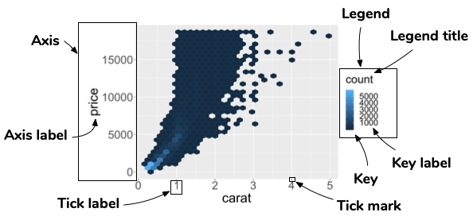

```{r, include = FALSE}
current_file <- knitr::current_input()
```
```{r, include = FALSE, eval = T}
input <- fs::path_ext_set(current_file, "html")
pagedown::chrome_print(input = input, format = "pdf", wait = 20)
```
```{r titleslide, child="assets/titleslide.Rmd"}
```
```{r, include = FALSE}
knitr::opts_chunk$set(
  fig.path = "images/day1-session3/",
  warning = FALSE,
  message = FALSE, 
  fig.align = "center"
)
library(tidyverse)
library(palmerpenguins)
```

---

class: transition middle animated slideInLeft

# .circle-big[3]
# Scales

---

class: font_smaller

# 💎 Diamonds data

The `diamonds` data is part of `ggplot2` 📦

```{r}
glimpse(diamonds)
```

---

class: font_smaller

# Scales 

* Scales control the mapping from .blue[data] to .blue[aesthetics]. 

<center>

</center>

```{r}
g <- ggplot(diamonds, aes(carat, price) ) + geom_hex()
```
--- 

.grid[

.item.border-right[ 
```{r diamond1, fig.height = 3.5, fig.width = 4}
g + scale_y_continuous() +
  scale_x_continuous()
```
```{r diamond1, fig.height = 3.5, fig.width = 4, fig.show='hide', dev = 'pdf', echo = FALSE}
```

] 

.item.border-right[ 

```{r diamond2, fig.height = 3.5, fig.width = 4}
g + scale_x_reverse() +
  scale_y_continuous(trans="log10")
```

] 

.item[ 

```{r diamond3, fig.height = 3.5, fig.width = 4}
g + scale_y_log10() + 
  scale_x_sqrt()
```


] 

]

---

name: scale
class: hide-slide-number

# `scale`


```{r scale, echo=FALSE}
scales <- help.search("^scale_", package = "ggplot2")
scales$matches %>% 
  select(Entry, Title) %>% 
  group_by(Title) %>% 
  mutate(col = paste0("C", 1:n())) %>% 
  ungroup() %>% 
  pivot_wider(names_from = col, values_from = Entry) %>% 
  mutate(scales = paste(C1, C2, C3, C4, C5, C6, C7, C8, C9, C10, C11, C12, C13, sep = ", "),
         scales = gsub(", NA", "", scales)) %>% 
  select(scales, Title) %>% 
  DT::datatable(colnames = c("scales", "Description"),
                rownames = FALSE,
                options = list(dom = 'tp', ordering=F, pageLength = 4,
                               autoWidth = TRUE, columnDefs = list(list(width = '400px', targets = c(0)))),
                )

```

---
# Guide: an axis or a legend 

* The scale creates a .blue[guide]: an .blue[axis] or .blue[legend].
* So to modify these you generally use .blue[`scale_*`] or other handy functions (`guides`, `labs`, `xlab`, `ylab` and so on).

<center>

</center>


---

# Modify axis 


```{r, fig.height = 4, fig.width = 6}
g + 
  scale_y_continuous(name = "Price", 
                     breaks = c(0, 10000),
                     labels = c("0", "More\n than\n 10K")) + 
  geom_hline(yintercept = 10000, color = "red", size = 2)
```

---

# Nicer formatting functions in `scales` 📦

```{r, fig.height = 4, fig.width = 6}
g + 
  scale_y_continuous(
    label = scales::dollar_format()  #<<
  )
```

---

# Modifying legend


```{r, fig.height = 4, fig.width = 6}
g + 
  scale_fill_continuous(
    breaks = c(0, 10, 100, 1000, 4000),
    trans = "log10"
  )
```

---

# Removing legend 

```{r, fig.height = 4, fig.width = 6}
g + 
  scale_fill_continuous(
    guide = "none"
  )
```

---

# Alternative control of guides

```{r, fig.height = 4, fig.height = 4}
g + 
  ylab("Price") + # Changes the y axis label
  labs(x = "Carat", # Changes the x axis label
       fill = "Count") # Changes the legend name 
```

```{r, eval = FALSE}
g + guides(fill = "none") # remove the legend
```

---

class: transition middle animated slideInLeft

# .circle-big[4]
# Color space

.footnote.monash-bg-blue[
Zeileis, Fisher, Hornik, Ihaka, McWhite,
Murrell, Stauffer, Wilke (2019). colorspace: A
Toolbox for Manipulating and Assessing Colors and
Palettes. *arXiv 1903.06490*

Zeileis, Hornik, Murrell (2009). Escaping RGBland:
Selecting Colors for Statistical Graphics.
_Computational Statistics & Data Analysis_ 53(9)
3259-3270
]

---

class: font_smaller center

# Qualitative palettes

designed for categorical variable with no particular ordering 


```{r, fig.height = 6, fig.width = 8}
colorspace::hcl_palettes("Qualitative", plot = "TRUE", n = 7)
```

---


class: font_smaller center

# Sequential palettes

designed for ordered categorical variable or number going from low to high (or vice-versa) 


```{r, fig.height = 6, fig.width = 10}
colorspace::hcl_palettes("Sequential", plot = "TRUE", n = 7)
```

---

class: font_smaller center

# Diverging palettes

designed for ordered categorical variable or number going from low to high (or vice-versa) with a neutral value in between


```{r, fig.height = 6, fig.width = 8}
colorspace::hcl_palettes("Diverging", plot = "TRUE", n = 7)
```

---

class: no-header-strip rgb-slider-wrap center white

# RGB color space

made for screen projection

 <br><br>
  <div class="col-sliders">
      <div>
          <label for="red">Red</label>
          <input type="number" id="redNum">
          <input value="0" type="range" min="0" max="255" id="red">
      </div>
      <div>
          <label for="green">Green</label>
          <input type="number" id="greenNum">
          <input value="109" type="range" min="0" max="255" id="green">
      </div>
      <div>
          <label for="blue">Blue</label>
          <input type="number" id="blueNum">
          <input  value="174" type="range" min="0" max="255" id="blue">
      </div>
  </div>

.footnote.bg-transparent[
Code adapted from https://github.com/Golobro/rgbcolorslider
]

---

class: no-header-strip hcl-slider-wrap center white

# HCL color space

made for human visual system

 <br><br>
  <div class="col-sliders">
      <div>
          <label for="hue">Hue</label>
          <input type="number" id="hueNum">
          <input value="268" type="range" min="0" max="360" id="hue">
      </div>
      <div>
          <label for="chroma">Chroma</label>
          <input type="number" id="chromaNum">
          <input value="42" type="range" min="0" max="180" id="chroma">
      </div>
      <div>
          <label for="luminance">Luminance</label>
          <input type="number" id="luminanceNum">
          <input  value="44" type="range" min="0" max="100" id="luminance">
      </div>
  </div>

.footnote.bg-transparent[
Color conversion using https://github.com/gka/chroma.js
]

---

# `colorspace` 📦

.center[
Interactively choose/create a palette using the HCL color space. 
]

.grid[
.item[
]
.item[

<br>
```{r, eval = FALSE}
library(colorspace)
hcl_wizard() # OR choose_palette()
```
<br>
.center.animated.rubberBand[
.tag[LIVE DEMO]
<br>
]


]
.item[

]
]

---

class: font_smaller

# `hcl_wizard`

<center>
<br>

Choose your palette > Export > R > Copy the command 

</center>

---

class: font_smaller

# Registering your own palette

.grid[
.item[
```{r}
library(colorspace)
# register your palette
sequential_hcl(n = 7, 
               h = c(300, 200), 
               c = c(60, 0), 
               l = c(25, 95), 
               power = c(2.1, 0.8), 
               register = "my-set")
# now generate from your palette
sequential_hcl(n = 3, 
               palette = "my-set")
```

]
.item[

{{content}}

]
]

--

```{r, fig.height = 1.5}
hcl_palettes(n = 5, palette = "my-set", plot = T)
```
<br>
Combining with `ggplot`:
```{r, fig.height = 2}
ggplot(penguins, 
       aes(bill_length_mm, fill = species)) + 
 geom_density(alpha = 0.6) + 
  # notice here you don't need to specify the n!
 scale_fill_discrete_sequential(palette = "my-set")
```

---

class: font_smaller

# Manually selecting colors
<center>

</center>

```{r, fig.height = 3}
g <- ggplot(penguins, 
       aes(bill_length_mm, fill = species)) + 
 geom_density(alpha = 0.6) + 
 scale_fill_manual(
   breaks = c("Adelie", "Chinstrap", "Gentoo"), # optional but makes it more robust
   values = c("darkorange", "purple", "cyan4"))
g
```

---

class: font_smaller

# Check that it's colour blind friendly! 
```{r}
cols <- c("darkorange", "purple", "cyan4")
```

.grid[
.item50.border-right[
```{r, fig.height = 3}
g # original
g + scale_fill_manual(values = deutan(cols))
```

]
.item50[
```{r, fig.height = 3}
g + scale_fill_manual(values = protan(cols))
g + scale_fill_manual(values = tritan(cols))
```
]

]


---

```{r endslide, child="assets/endslide.Rmd"}
```

