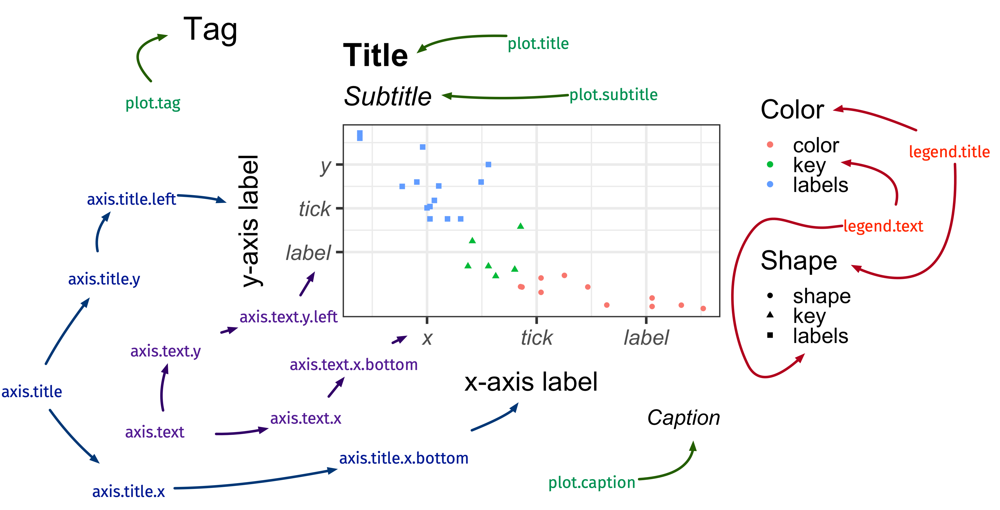

```{r, include = FALSE}
current_file <- knitr::current_input()
```
```{r, include = FALSE, eval = F}
input <- fs::path_ext_set(current_file, "html")
pagedown::chrome_print(input = input, format = "pdf", wait = 20)
```
```{r titleslide, child="assets/titleslide.Rmd"}
```
```{r, include = FALSE}
knitr::opts_chunk$set(
  fig.path = "images/day1-session4/",
  warning = FALSE,
  message = FALSE,
  fig.align = "center"
)
library(tidyverse)
filter <- dplyr::filter
library(palmerpenguins)
library(colorspace)
```


---

class: transition middle animated slideInLeft

# .circle-big[5]
# Publication-ready plots

---

# The `ggplot` object

.info-box[

* .monash-blue[**Modifiable**]: `ggplot` object can be modified
* .monash-blue[**Generalisable**]: `ggplot2` uses a cohesive and complex system under the hood to make many kinds of plots
* .monash-blue[**Extensible**]: the system can be extended to make specialised plots or add more features if the same "grammar" is adopted

]

---

class: font_smaller

# Motor Trend Car Road Tests

The `mtcars` is from the `datasets` 📦 (loaded by default)

```{r}
mtcars_df <- mtcars %>% rownames_to_column("car")
glimpse(mtcars_df)
```
---


class: font_smaller

# `ggrepel` 📦 .font_small[one of my favorites!]

.grid[.item[
```{r, fig.height = 4, fig.width = 7}
ggplot(mtcars_df, aes(wt, mpg)) + 
  geom_point(size = 2, color = "red") + 
  geom_text(aes(label = car)) +
  ggtitle("geom_text()")
```
{{content}}
]
.item[
```{r, fig.height = 4, fig.width = 7}
library(ggrepel)
set.seed(1)
ggplot(mtcars_df, aes(wt, mpg)) + 
  geom_point(size = 2, color = "red") + 
  geom_text_repel(aes(label = car))+
  ggtitle("geom_text_repel()")
```
]
]


.footnote[
Kamil Slowikowski (2020). ggrepel: Automatically Position
  Non-Overlapping Text Labels with 'ggplot2'. R package version 0.8.2.
  https://CRAN.R-project.org/package=ggrepel
]

--

There are many [extension packages](https://exts.ggplot2.tidyverse.org/)!

---

class: middle transition

# Themes

---

class: center

# `theme`: modify the *look* of texts




.font_large[`element_text()`]

---

class: font_small

# `element_text()`

<div class="grid" style="grid: 1fr / 1fr 1fr;">

.item[ 

```{r ele-text, eval = F}
ggplot(diamonds, aes(carat, price)) + 
  geom_hex() +
 labs(title = "Diamond") +
 theme(axis.title.x = element_text(size = 30,
                                 color = "red",
                                 face = "bold",
                                 angle = 10,
                                 family = "Fira Code"),
       legend.title = element_text(size = 25,
                                   color = "#ef42eb", 
                                   margin = margin(b = 5)),
       plot.title = element_text(size = 35,
                                 face = "bold",
                                 family = "Nunito",
                                 color = "blue"
                                ))
```

]

.item[ 

```{r ele-text, echo = F, fig.width = 3.8, fig.height = 4.5}
```

]

</div>

---

class: center

# `theme`: modify the *look* of the lines


.font_large[`element_line()`]

---

class: font_small

# `element_line()`


<div class="grid" style="grid: 1fr / 1fr 1fr;">

.item[ 

```{r ele-line, eval = F}
ggplot(penguins, aes(bill_length_mm, bill_depth_mm)) + 
  geom_point() +
  theme(axis.line.y = element_line(color = "black",
                                  size = 1.2,
                                  arrow = grid::arrow()),
       axis.line.x = element_line(linetype = "dashed", 
                                  color = "brown",
                                  size = 1.2),
       axis.ticks = element_line(color = "red", size = 1.1),
       axis.ticks.length = unit(3, "mm"),
       panel.grid.major = element_line(color = "blue", 
                                       size = 1.2),
       panel.grid.minor = element_line(color = "#0080ff",
                                       size = 1.2,
                                       linetype = "dotted"))
```


] 

.item[ 

```{r ele-line, echo = F, fig.width = 3.2, fig.height = 4.5}
```


]

</div>

---

class: center

# `theme`: modify the *look* of the <br>rectangular regions


.font_large[`element_rect()`]


---

class: font_small

# `element_rect()`


<div class="grid" style="grid: 1fr / 1fr 1fr;">

.item[ 

```{r ele-rect, eval = F}
ggplot(penguins, aes(bill_length_mm, bill_depth_mm)) + 
 geom_point(aes(color = species)) +
 theme(
  legend.background = element_rect(fill = "#fff6c2", 
                                  color = "black",
                               linetype = "dashed"),
  legend.key = element_rect(fill = "grey", color = "brown"),
  panel.background = element_rect(fill = "#005F59",
                          color = "red", size = 3),
  panel.border = element_rect(color = "black", 
                              fill = "transparent",
                    linetype = "dashed", size = 3),
  plot.background = element_rect(fill = "#a1dce9",
                                color = "black",
                                 size = 1.3),
  legend.position = "bottom")
```


] 

.item[ 

```{r ele-rect, echo = F, fig.width = 3.2, fig.height = 4.5}
```

]

</div>

---

class: font_smaller

# Professional looking plots *without* Adobe Illustrator (or alike)

.grid[
.item[
```{r pro-plot1, eval = F}
ggplot(mtcars_df, 
       aes(wt, mpg, shape = factor(vs), color = hp)) + 
 geom_point(size = 3) 
```

]
.item[
```{r pro-plot1, echo = F, fig.width = 5}
```

]
]

---

count: false
class: font_smaller

# Professional looking plots *without* Adobe Illustrator (or alike)

.grid[
.item[
```{r pro-plot2, eval = F}
ggplot(mtcars_df, 
       aes(wt, mpg, shape = factor(vs), color = hp)) + 
 geom_point(size = 3) + 
 scale_color_continuous_sequential(palette = "Dark Mint") + 
 scale_shape_discrete(labels = c("V-shaped", "Straight")) 
```

]
.item[
```{r pro-plot2, echo = F, fig.width = 5}
```

]
]

---

count: false
class: font_smaller

# Professional looking plots *without* Adobe Illustrator (or alike)

.grid[
.item[
```{r pro-plot3, eval = F}
ggplot(mtcars_df, 
       aes(wt, mpg, shape = factor(vs), color = hp)) + 
 geom_point(size = 3) + 
 scale_color_continuous_sequential(palette = "Dark Mint") + 
 scale_shape_discrete(labels = c("V-shaped", "Straight")) + 
 labs(x = "Weight (1000 lbs)", y = "Miles per gallon",
      title = "Motor Trend Car Road Tests",
      shape = "Engine", color = "Horsepower") 
```

]
.item[
```{r pro-plot3, echo = F, fig.width = 5}
```

]
]

---

count: false
class: font_smaller

# Professional looking plots *without* Adobe Illustrator (or alike)

.grid[
.item[
```{r pro-plot4, eval = F}
ggplot(mtcars_df, 
       aes(wt, mpg, shape = factor(vs), color = hp)) + 
 geom_point(size = 3) + 
 scale_color_continuous_sequential(palette = "Dark Mint") + 
 scale_shape_discrete(labels = c("V-shaped", "Straight")) + 
 labs(x = "Weight (1000 lbs)", y = "Miles per gallon",
      title = "Motor Trend Car Road Tests",
      shape = "Engine", color = "Horsepower") +
 theme(text = element_text(size = 18))
```

]
.item[
```{r pro-plot4, echo = F, fig.width = 5}
```

]
]

---

count: false
class: font_smaller

# Professional looking plots *without* Adobe Illustrator (or alike)

.grid[
.item[
```{r pro-plot5, eval = F}
ggplot(mtcars_df, 
       aes(wt, mpg, shape = factor(vs), color = hp)) + 
 geom_point(size = 3) + 
 scale_color_continuous_sequential(palette = "Dark Mint") + 
 scale_shape_discrete(labels = c("V-shaped", "Straight")) + 
 labs(x = "Weight (1000 lbs)", y = "Miles per gallon",
      title = "Motor Trend Car Road Tests",
      shape = "Engine", color = "Horsepower") +
 theme(text = element_text(size = 18),
       rect = element_rect(fill = "black")) 
```

]
.item[
```{r pro-plot5, echo = F, fig.width = 5}
```

]
]

---

count: false
class: font_smaller

# Professional looking plots *without* Adobe Illustrator (or alike)

.grid[
.item[
```{r pro-plot6, eval = F}
ggplot(mtcars_df, 
       aes(wt, mpg, shape = factor(vs), color = hp)) + 
 geom_point(size = 3) + 
 scale_color_continuous_sequential(palette = "Dark Mint") + 
 scale_shape_discrete(labels = c("V-shaped", "Straight")) + 
 labs(x = "Weight (1000 lbs)", y = "Miles per gallon",
      title = "Motor Trend Car Road Tests",
      shape = "Engine", color = "Horsepower") +
 theme(text = element_text(size = 18, color = "white"),
       rect = element_rect(fill = "black"))
```

]
.item[
```{r pro-plot6, echo = F, fig.width = 5}
```

]
]

---

count: false
class: font_smaller

# Professional looking plots *without* Adobe Illustrator (or alike)

.grid[
.item[
```{r pro-plot7, eval = F}
ggplot(mtcars_df, 
       aes(wt, mpg, shape = factor(vs), color = hp)) + 
 geom_point(size = 3) + 
 scale_color_continuous_sequential(palette = "Dark Mint") + 
 scale_shape_discrete(labels = c("V-shaped", "Straight")) + 
 labs(x = "Weight (1000 lbs)", y = "Miles per gallon",
      title = "Motor Trend Car Road Tests",
      shape = "Engine", color = "Horsepower") +
 theme(text = element_text(size = 18, color = "white"),
       rect = element_rect(fill = "black"),
       panel.background = element_rect(fill = "black"),
       legend.key = element_rect(fill = "black")) 
```

]
.item[
```{r pro-plot7, echo = F, fig.width = 5}
```

]
]

---

count: false
class: font_smaller

# Professional looking plots *without* Adobe Illustrator (or alike)

.grid[
.item[
```{r pro-plot8, eval = F}
ggplot(mtcars_df, 
       aes(wt, mpg, shape = factor(vs), color = hp)) + 
 geom_point(size = 3) + 
 scale_color_continuous_sequential(palette = "Dark Mint") + 
 scale_shape_discrete(labels = c("V-shaped", "Straight")) + 
 labs(x = "Weight (1000 lbs)", y = "Miles per gallon",
      title = "Motor Trend Car Road Tests",
      shape = "Engine", color = "Horsepower") +
 theme(text = element_text(size = 18, color = "white"),
       rect = element_rect(fill = "black"),
       panel.background = element_rect(fill = "black"),
       legend.key = element_rect(fill = "black")) + 
  guides(shape = 
      guide_legend(override.aes = list(color = "white")))
```

]
.item[
```{r pro-plot8, echo = F, fig.width = 5}
```

]
]

---

count: false
class: font_smaller

# Professional looking plots *without* Adobe Illustrator (or alike)

.grid[
.item[
```{r pro-plot9, eval = F}
ggplot(mtcars_df, 
       aes(wt, mpg, shape = factor(vs), color = hp)) + 
 geom_point(size = 3) + 
 scale_color_continuous_sequential(palette = "Dark Mint") + 
 scale_shape_discrete(labels = c("V-shaped", "Straight")) + 
 labs(x = "Weight (1000 lbs)", y = "Miles per gallon",
      title = "Motor Trend Car Road Tests",
      shape = "Engine", color = "Horsepower") +
 theme(text = element_text(size = 18, color = "white"),
       rect = element_rect(fill = "black"),
       panel.background = element_rect(fill = "black"),
       legend.key = element_rect(fill = "black"),
       axis.text = element_text(color = "white")) + 
  guides(shape = 
      guide_legend(override.aes = list(color = "white")))
```

]
.item[
```{r pro-plot9, echo = F, fig.width = 5}
```

]
]

---

count: false
class: font_smaller

# Professional looking plots *without* Adobe Illustrator (or alike)

.grid[
.item[
```{r pro-plot10, eval = F}
ggplot(mtcars_df, 
       aes(wt, mpg, shape = factor(vs), color = hp)) + 
 geom_point(size = 3) + 
 scale_color_continuous_sequential(palette = "Dark Mint") + 
 scale_shape_discrete(labels = c("V-shaped", "Straight")) + 
 labs(x = "Weight (1000 lbs)", y = "Miles per gallon",
      title = "Motor Trend Car Road Tests",
      shape = "Engine", color = "Horsepower") +
 theme(text = element_text(size = 18, color = "white"),
       rect = element_rect(fill = "black"),
       panel.background = element_rect(fill = "black"),
       legend.key = element_rect(fill = "black"),
       axis.text = element_text(color = "white"),
       plot.title.position = "plot") + 
  guides(shape = 
      guide_legend(override.aes = list(color = "white")))
```

]
.item[
```{r pro-plot10, echo = F, fig.width = 5}
```

]
]


---

count: false
class: font_smaller

# Professional looking plots *without* Adobe Illustrator (or alike)

.grid[
.item[
```{r pro-plot, eval = F}
ggplot(mtcars_df, 
       aes(wt, mpg, shape = factor(vs), color = hp)) + 
 geom_point(size = 3) + 
 scale_color_continuous_sequential(palette = "Dark Mint") + 
 scale_shape_discrete(labels = c("V-shaped", "Straight")) + 
 labs(x = "Weight (1000 lbs)", y = "Miles per gallon",
      title = "Motor Trend Car Road Tests",
      shape = "Engine", color = "Horsepower") +
 theme(text = element_text(size = 18, color = "white"),
       rect = element_rect(fill = "black"),
       panel.background = element_rect(fill = "black"),
       legend.key = element_rect(fill = "black"),
       axis.text = element_text(color = "white"),
       plot.title.position = "plot",
       plot.margin = margin(10, 10, 10, 10)) + 
 guides(shape = 
      guide_legend(override.aes = list(color = "white")))
```

]
.item.animated.tada.delay-2s[
```{r pro-plot, echo = F, fig.width = 5}
```

]
]

---

class: font_smaller

# Built-in themes

.center[
There are many existing themes

(you can also make your own)
]

```{r}
g <- ggplot(mtcars_df, aes(wt, mpg)) + geom_point(size = 3) +
  labs(x = "Weight (1000 lbs)", y = "Miles per gallon")
```


.grid[.item2.border-right[
```{r, fig.height = 4, fig.width = 4}
g + theme_bw()
```
]
.item2.border-right[
```{r, fig.height = 4, fig.width = 4}
g + theme_classic()
```
]
.item2[
```{r, fig.height = 4, fig.width = 4}
g + theme_dark()
```
]

]


---

class: font_smaller

# Combining plots with `patchwork` 📦 

```{r, fig.height = 4, fig.width = 12}
library(patchwork)
g1 <- ggplot(penguins, aes(bill_length_mm, body_mass_g, color = species)) + 
  geom_point() + theme_bw(base_size = 18) + 
  labs(tag = "(A)", x = "Bill length (mm)", y = "Body mass (g)", color = "Species")
g2 <- ggplot(penguins, aes(bill_length_mm, fill = species)) +
  geom_density() + theme_bw(base_size = 18) + 
  labs(tag = "(B)", x = "Bill length (mm)", y = "Density", fill = "Species")
g1 + g2 #<<
```


.footnote[
Thomas Lin Pedersen (2020). patchwork: The Composer of Plots. R package
  version 1.0.1. https://CRAN.R-project.org/package=patchwork
]

---

class: exercise middle hide-slide-number


<i class="fas fa-users"></i>

# <i class="fas fa-code"></i> Open `day1-exercise-04.Rmd`

<center>
`r countdown::countdown(15, class = "clock")`
</center>

---

```{r endslide, child="assets/endslide.Rmd"}
```

