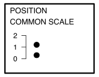

```{r, include = FALSE}
current_file <- knitr::current_input()
```
```{r, include = FALSE, eval = F}
input <- fs::path_ext_set(current_file, "html")
pagedown::chrome_print(input = input, format = "pdf", wait = 25)
```
```{r titleslide, child="assets/titleslide2.Rmd"}
```
```{r, include = FALSE}
knitr::opts_chunk$set(
  fig.path = "images/day2-session4/",
  fig.width = 6,
  fig.height = 4,
  fig.align = "center",
  out.width = "100%",
  echo = FALSE,
  fig.retina = 3,
  warning = FALSE,
  message = FALSE,
  cache = FALSE
)
```

```{r, include = FALSE}
library(tidyverse)
filter <- dplyr::filter
select <- dplyr::select
library(ggthemes)
library(viridis)
library(nullabor)
library(RColorBrewer)
library(grid)
library(gridSVG)
library(colorspace)
library(vcd)

vis_spacing <- 'style="padding-left:20px;"'
vis_spacing1 <- 'style="padding-left:10px;"'

grid_setup <- function(label) {
  grid.newpage()
  grid.rect(gp = gpar(lty = "solid", lwd = 3, fill = "white"), 
              width = unit(0.9, "npc"), 
              height = unit(0.9, "npc"))
  grid.text(label, x = 0.1, y = 0.9, 
            gp = gpar(fontsize = 13), just = c("left", "top"))
  pushViewport(plotViewport(c(2, 3, 4, 3)))
}
```

```{r tbtidy, echo=FALSE}
tb <- read_csv(here::here("data/TB_notifications_2020-07-01.csv")) %>% 
  dplyr::select(country, iso3, year, new_sp_m04:new_sp_fu) %>%
  pivot_longer(cols=new_sp_m04:new_sp_fu, names_to="sexage", values_to="count") %>%
  mutate(sexage = str_replace(sexage, "new_sp_", "")) %>%
  mutate(sex=substr(sexage, 1, 1), 
         age=substr(sexage, 2, length(sexage))) %>%
  dplyr::select(-sexage) %>%
  filter(!(age %in% c("04", "014", "514", "u"))) %>%
  filter(year > 1996, year < 2013) %>%
  mutate(age_group = factor(age, 
                            labels = c("15-24", "25-34", "35-44", 
                                       "45-54", "55-64", "65-"))) %>%
  dplyr::select(country, year, age_group, sex, count)

# Filter Australia
tb_oz <- tb %>% 
  filter(country == "Australia") 
```

---
class: middle
background-image: \url(images/who_wore_it_better.jpg)
background-size: 40%
background-position: 99% 50%

.font_large[Let's play a game: <br>Which plot wears it better?]

---
class: font_smaller2

On the next slide we have made **two different plots** of 2012 TB incidence in Australia, based on two variables:

```{r}
tb_oz %>% filter(year == 2012) %>% select(sex, age_group, count) %>% head(5)
```

- In arrangement A, separate plots are made for age, and sex is mapped to the x axis. 
- Conversely, in arrangement B, separate plots are made for sex, and age is mapped to the x axis. 

If you were to answer the question:  **At which age(s) are the counts for males and females relatively the same?** Which plot makes this easier?

---

.pull-left[
```{r focus on one year gender side-by-side bars of males/females, fig.height=3, out.width="100%"}
tb_oz %>% filter(year == 2012) %>%
  ggplot(aes(x = sex, y = count, fill = sex)) +
  geom_bar(stat = "identity", position = "dodge") + 
  facet_wrap(~age_group, ncol = 6) +
  scale_fill_brewer(name = "", palette = "Dark2") +
  ggtitle("Arrangement A")
```

```{r focus on one year age side-by-side bars of age group, fig.height=3, out.width="100%"}
tb_oz %>% filter(year == 2012) %>%
  ggplot(aes(x = age_group, y = count, fill = age_group)) +
  geom_bar(stat = "identity", position = "dodge") + 
  facet_wrap(~sex, ncol = 6) +
  scale_fill_brewer(name = "", palette = "Dark2") +
  ggtitle("Arrangement B")
```
]
.pull-right[
We've got two different rearrangements of the same information. **At which age(s) are the counts for males and females relatively the same?** Which plot makes this easier?

```{r}
countdown::countdown(0,30, bottom=0, right=0,
  font_size = "2em")
```

<br>
What do we learn? That is different from each? What's the focus of each? What's easy, what's harder? 
]

---
class: transition middle animated slideInLeft

Arrangement A makes it easier to directly compare male and female counts, separately for each age group. Generally, male counts are higher than female counts. There is a big difference between counts in the 45-54 age group, and over 65 counts are almost the same.

Arrangement B makes it easier to directly compare counts by age group, separately for females and males. For females, incidence drops in the middle years. For males, it is pretty consistently high across age groups. 

---
class: font_smaller2

.pull-left[
`r anicon::nia("Try to write out a question that would be easier to answer from arrangement B.", animate="float")`
]

.pull-right[

```{r ref.label='focus on one year gender side-by-side bars of males/females', fig.height=3}
```

```{r ref.label='focus on one year age side-by-side bars of age group', fig.height=3}
```
]

```{r}
countdown::countdown(0, 30, bottom=0, left=0,
  font_size = "2em")
```

---
class: font_smaller2

On the next slide we have made **two different plots** of TB incidence in the Australia, based on three variables:

```{r}
tb_oz %>% select(year, sex, age_group, count) %>% head(5)
```

- In plot type A, a line plot of counts is drawn separately by age and sex, and year is mapped to the x axis. 
- Conversely, in plot type B, counts for sex, and age are stacked into a bar chart, separately by age and sex, and year is mapped to the x axis

If you were to answer the question:  **The trend in incidence over years for females is generally decreasing?** Which plot makes this easier? 

---

.pull-left[
```{r use a line plot instead of bar, fig.width=10, fig.height=5}
ggplot(tb_oz, aes(x = year, y = count, colour = sex)) +
  geom_line() + geom_point() +
  facet_wrap(~age_group, ncol = 6) +
  scale_colour_brewer(name = "", palette = "Dark2") +
  ggtitle("Type A")
```

```{r colour and axes fixes, fig.width=10, fig.height=5}
# This uses a color blind proof scale
ggplot(tb_oz, aes(x = year, y = count, fill = sex)) +
  geom_bar(stat = "identity") + 
  facet_wrap(~age_group, ncol = 6) +
  scale_fill_brewer("", palette = "Dark2") +
  ggtitle("Type B")
```
]

.pull-right[

Which type of plot makes it easier to answer: **The trend in incidence over years for females is generally flat?** 

What are the pros and cons of each way of displaying the same information? Should specific limits on axes be made?

```{r}
countdown::countdown(0, 30, top=100, right=0,
  font_size = "2em")
```
]

---
class: transition middle animated slideInLeft

Plot type A makes it easier to examine trend for each group. This plot should probably have used 0 as the lower limit.

Plot type  B is really only allowing the overall trend in count to be examined separately by age. It is also possible to see trend for males. Trend for females is buried because the bars start at irregular heights. The separated bars distract from digesting the overall count. 

---

.pull-left[

The following plots focus on proportion of males vs females. Plot A computes the proportion and displays this as a line plot. Plot B uses a 100% chart of stacked bars for females and males. What are the strengths and weaknesses of each?

```{r}
countdown::countdown(0, 30, top=100, left=0,
  font_size = "2em")
```
]

.pull-right[
```{r use a line plot for proportions, fig.width=10, fig.height=5}
tb_oz %>% group_by(year, age_group) %>% 
  summarise(p = count[sex == "m"]/sum(count)) %>%
  ggplot(aes(x = year, y = p)) +
  geom_hline(yintercept = 0.50, colour = "white", size = 2) +
  geom_line() + geom_point() +
  facet_wrap(~age_group, ncol = 6) +
  ylab("proportion of males") +
  ggtitle("Type A")
```

```{r compare proportions of males/females, fig.width=10, fig.height=5}
# Fill the bars, note the small change to the code
ggplot(tb_oz, aes(x = year, y = count, fill = sex)) +
  geom_bar(stat = "identity", position = "fill") + 
  facet_wrap(~age_group, ncol = 6) +
  scale_fill_brewer(name = "", palette = "Dark2") + ylab("proportion") +
  ggtitle("Type B") + theme(legend.position = "bottom")
```
]

---
class: transition middle animated slideInLeft

Plot A makes it easier to examine the trend in proportion. It is easy to miss that all the proportions are greater than 0.5, despite having a guideline (white) at 0.5. It could be argued that setting the vertical axis limits could alleviate this.  The fluctuations from year to year are more visible. Maybe adding a trend model could be helpful, to reduce this noise. Without colour its less visually appealing.

Plot B makes it easier to see that the proportion for males is almost always higher than for females. It also suggests that there is little temporal trend, because the small fluctuations between years is less visible. Having colour makes it more visually appealing. There s less data processing.
---
# Perceptual principles

- Hierarchy of mappings
- Pre-attentive: some elements are noticed before you even realise it.
- Color palettes: qualitative, sequential, diverging, *palindrome*.
- Proximity: Place elements for primary comparison close together. 
- Change blindness: When focus is interrupted differences may not be noticed.

---

```{r task-position-common-scale, include = FALSE, fig.height = 1.8, fig.width = 2.3}
grid_setup("POSITION\nCOMMON SCALE")
pushViewport(dataViewport(c(0, 1), c(0, 2)))
grid.yaxis(at = 0:2)
grid.points(c(0.2, 0.2), c(1.2, 0.3), pch = 19)
```
```{r task-position-non-aligned-scale, include = FALSE, fig.height = 1.8, fig.width = 2.3}
grid_setup("POSITION\nNON-ALIGNED SCALE")
pushViewport(viewport(layout = grid.layout(1, 2, widths = unit(0.5, "npc"),
                         heights = unit(1, "npc")), name = "row1-col2"),
             viewport(layout.pos.col = 1, layout.pos.row = 1),
             dataViewport(c(0, 1), c(0, 2), extension = 0))
grid.yaxis(at = 0:2)
grid.rect(y = 0, x = 0.2, just = "bottom", gp = gpar(fill = "black"), 
              width = unit(2, "mm"), 
              height = 0.5)
seekViewport("row1-col2")
pushViewport(viewport(layout.pos.col = 2, layout.pos.row = 1),
             plotViewport(c(0, 1, 0, 0)),
             dataViewport(c(0, 1), c(0, 5), extension = 0))
grid.yaxis(at = 0:5)
grid.rect(y = 0, x = 0.25, just = "bottom", gp = gpar(fill = "black"), 
              width = unit(2, "mm"), 
              height = 0.5)
```
```{r task-length, include = FALSE, fig.height = 1.8, fig.width = 2.3}
grid_setup("LENGTH")
grid.lines(x = c(0.5, 0.5), y = c(0, 0.8), gp = gpar(lwd = 3))
grid.lines(x = c(0.3, 0.3), y = c(0, 0.4), gp = gpar(lwd = 3))
```


```{r task-direction, include = FALSE, fig.height = 1.8, fig.width = 2.3}
grid_setup("DIRECTION")
grid.lines(x = c(0.5, 0.6), y = c(0.2, 0.8), gp = gpar(lwd = 3), 
           arrow = arrow())
grid.lines(x = c(0.3, 0), y = c(0.2, 0.7), gp = gpar(lwd = 3),
           arrow = arrow())
```

```{r task-angle, include = FALSE, fig.height = 1.8, fig.width = 2.3}
grid_setup("ANGLE")
grid.lines(x = c(0.8, 1), y = c(0.2, 0.8), gp = gpar(lwd = 3))
grid.lines(x = c(0.8, 0.6), y = c(0.2, 0.8), gp = gpar(lwd = 3))
grid.lines(x = c(0.3, 0.4), y = c(0.2, 0.8), gp = gpar(lwd = 3))
grid.lines(x = c(0.3, 0.3), y = c(0.2, 0.8), gp = gpar(lwd = 3))
```
```{r task-area, include = FALSE, fig.height = 1.8, fig.width = 2.3}
grid_setup("AREA")
grid.circle(gp = gpar(fill = "black"))
grid.circle(gp = gpar(fill = "black"), x = 0, y = 0.9, r = 0.1)
```
```{r task-volume, include = FALSE, fig.height = 1.8, fig.width = 2.3}
grid_setup("VOLUME")
# stick 1
grid.polyline(x = c(0, 0, 0.3, 0.3, 0),
             y = c(0, 0.3, 0.3, 0, 0),
             gp=gpar(lwd = 3))
grid.polyline(x = c(0.3, 0.4, 0.4, 0.1, 0),
             y = c(0, 0.1, 0.4, 0.4, 0.3),
             gp=gpar(lwd = 3))
grid.polyline(x = c(0.3, 0.4), y = c(0.3, 0.4),
             gp=gpar(lwd = 3))
# stick 2
grid.polyline(x = c(0.5, 0.5, 0.8, 0.8, 0.5),
             y = c(0.1, 0.8, 0.8, 0.1, 0.1),
             gp=gpar(lwd = 3))
grid.polyline(x = c(0.8, 0.9, 0.9, 0.6, 0.5),
             y = c(0.1, 0.2, 0.9, 0.9, 0.8),
             gp=gpar(lwd = 3))
grid.polyline(x = c(0.8, 0.9), y = c(0.8, 0.9),
             gp=gpar(lwd = 3))
```
```{r task-curvature, include = FALSE, fig.height = 1.8, fig.width = 2.3}
grid_setup("CURVATURE")
grid.bezier(c(0.5, 0.5, 0.8, 0.8), c(0.4, 0.8, 0.8, 0.4),
            gp = gpar(lwd = 3))
grid.bezier(c(0.2, 0.2, 0.4, 0.4), c(0.2, 0.4, 0.4, 0.2),
            gp = gpar(lwd = 3))
```
```{r task-texture, include = FALSE, fig.height = 1.8, fig.width = 2.3}
grid_setup("TEXTURE")
grid.rect(0.1, 0.3, name = "rect1", width = 0.5, height = 0.4,
          gp = gpar(lwd = 3))
grid.rect(0.5, 0.95, name = "rect2", width = 0.3, height = 0.4,
          gp = gpar(lwd = 3))
grid.rect(0.95, 0.3, name = "rect3", width = 0.3, height = 0.5,
          gp = gpar(lwd = 3))
pat1 <- pattern(linesGrob(gp=gpar(lwd=5)),
  width = unit(0.04, "npc"), height = unit(0.04, "npc"),
  dev.width = 0.5, dev.height = 0.4)
pat2 <- pattern(linesGrob(c(0, 3), c(0, 3), gp=gpar(lwd=5)),
  width = unit(0.1, "npc"), height = unit(0.1, "npc"),
  dev.width = 0.3, dev.height = 0.4)
pat3 <- pattern(circleGrob(r = 0.3, gp=gpar(fill="black")),
  dev.width = 0.05, dev.height = 0.08)
grid.patternFill("rect1", pattern = pat1)
grid.patternFill("rect2", pattern = pat2)
grid.patternFill("rect3", pattern = pat3)
# pattern only shows up if below is done
grid.export(here::here("task-texture.svg"))
```
```{r task-shape, include = FALSE, fig.height = 1.8, fig.width = 2.3}
grid_setup("SHAPE")
grid.points(x = rep((1:4)/4.5, each = 4), y = rep((1:4)/4.5, times = 4), pch = c(1:16),
            size = unit(0.75, "char"))
```
```{r task-color-hue, include = FALSE, fig.height = 1.8, fig.width = 2.3}
grid_setup("COLOR HUE")
grid.points(x = rep((1:4)/4.5, each = 4), y = rep((1:4)/4.5, times = 4), 
            size = unit(1, "char"), pch = 16,
            gp = gpar(col = hcl2hex(seq(0, 360, length.out = 16), 100, 60)))
```
```{r task-color-chroma, include = FALSE, fig.height = 1.8, fig.width = 2.3}
grid_setup("COLOR CHROMA")
grid.points(x = rep((1:4)/4.5, each = 4), y = rep((1:4)/4.5, times = 4), 
            size = unit(1, "char"), pch = 16,
            gp = gpar(col = hcl2hex(0, seq(0, 360, length.out = 16), 60)))
```
```{r task-color-luminance, include = FALSE, fig.height = 1.8, fig.width = 2.3}
grid_setup("COLOR LUMINANCE")
grid.points(x = rep((1:4)/4.5, each = 4), y = rep((1:4)/4.5, times = 4), 
            size = unit(1, "char"), pch = 16,
            gp = gpar(col = hcl2hex(0, 35, seq(0, 100, length.out = 16))))
```
```{r task-color-saturation, include = FALSE, fig.height = 1.8, fig.width = 2.3}
grid_setup("COLOR SATURATION")
grid.points(x = rep((1:4)/4.5, each = 4), y = rep((1:4)/4.5, times = 4), 
            size = unit(1, "char"), pch = 16,
            gp = gpar(col = hex(HSV(0, seq(0, 1, length.out = 16), 0.6))))
```
```{r task-color-shade, include = FALSE, fig.height = 1.8, fig.width = 2.3}
grid_setup("COLOR SHADE")
grid.points(x = rep((1:4)/4.5, each = 4), y = rep((1:4)/4.5, times = 4), 
            size = unit(1, "char"), pch = 16,
            gp = gpar(col = hex(HSV(0, 0.6, seq(0, 1, length.out = 16)))))
```


.grid[
.item.center[



{{content}}


]]

---
# Hierarchy of mappings

.pull-left[
1. Position - common scale (BEST)
2. Position - nonaligned scale
3. Length, direction, angle
4. Area
5. Volume, curvature
6. Shading, color (WORST)

(Cleveland, 1984; Heer and Bostock, 2009)

`r anicon::nia("Try to come up with a plot type for one of the mappings.", animate="float", color="red")`


]
--

.pull-right[

1. scatterplot, barchart
2. side-by-side boxplot, stacked barchart
3. piechart, rose plot, gauge plot, donut, wind direction map, starplot
4. treemap, bubble chart, mosaicplot
5. chernoff face
6. choropleth map

]

---
# Pre-attentive

Can you find the odd one out?

```{r is shape preattentive, echo=FALSE, out.width="50%"}
set.seed(20190715)
df <- data.frame(x = runif(100), y = runif(100), cl=sample(c(rep("A", 1), rep("B", 99))))
ggplot(data=df, aes(x, y, shape = cl)) + theme_bw() + 
  geom_point(size = 3) +
  theme(legend.position = "None", aspect.ratio = 1)
```

---
# Pre-attentive

Is it easier now?

```{r is color preattentive, echo=FALSE, out.width="50%"}
ggplot(df, aes(x, y, colour = cl)) + 
  geom_point(size = 3) +
  theme_bw() + 
  scale_colour_brewer(palette = "Set1") +
  theme(legend.position = "none", aspect.ratio = 1)
```

---
# Proximity

Place elements that you want to compare close to each other. If there are multiple comparisons to make, you need to decide which one is most important.

.font_small[
```{r a line plot on sex, fig.show='hide', echo=TRUE}
ggplot(tb_oz, aes(x = year, y = count, colour = sex)) +
  geom_line() + geom_point() +
  facet_wrap(~age_group, ncol = 6) +
  ylim(c(0, 70)) +
  scale_colour_brewer(name = "", palette = "Dark2") +
  ggtitle("Arrangement A")
```

```{r a line plot on age, fig.show='hide', echo=TRUE}
ggplot(tb_oz, aes(x = year, y = count, colour = age_group)) +
  geom_line() + geom_point() +
  facet_wrap(~sex, ncol = 2) +
  ylim(c(0, 70)) +
  scale_colour_brewer(name = "", palette = "Dark2") +
  ggtitle("Arrangement B")
```
]
---

```{r ref.label="a line plot on sex", echo=FALSE, fig.width=10, fig.height=3, out.width="70%"}
```

```{r ref.label="a line plot on age", echo=FALSE, fig.width=5, fig.height=3, out.width="50%"}
```

---
# Mapping and proximity

.pull-left[
Same proximity is used, but different geoms. Is one better than the other to determine the relative ratios of males to females by age?
]
.pull-right[
```{r side-by-side bars of males/females, fig.height=2.5}
tb_oz %>% filter(year == 2012) %>%
  ggplot(aes(x = sex, y = count, fill = sex)) +
  geom_bar(stat = "identity", position = "dodge") + 
  facet_wrap(~age_group, ncol = 6) +
  scale_fill_brewer(name = "", palette = "Dark2") +
  ggtitle("Position - common scale ")
```

```{r piecharts of males/females, fig.height=3}
tb_oz %>% filter(year == 2012) %>%
  ggplot(aes(x = 1, y = count, fill = sex)) +
  geom_bar(stat = "identity", position = "fill") + 
  facet_wrap(~age_group, ncol = 3) +
  scale_fill_brewer("", palette = "Dark2") +
  ggtitle("Angle") + xlab("") + ylab("") +
  coord_polar(theta = "y")
```
]

---
# Mapping and proximity

.pull-left[
Same proximity is used, but different geoms. Is one better than the other to determine the relative ratios of ages by sex?
]
.pull-right[
```{r side-by-side bars of age, fig.height=3}
tb_oz %>% filter(year == 2012) %>%
  ggplot(aes(x = age_group, y = count, fill = age_group)) +
  geom_bar(stat = "identity", position = "dodge") + 
  facet_wrap(~sex, ncol = 6) +
  scale_fill_brewer(name = "", palette = "Dark2") +
  ggtitle("Position - common scale ")
```

```{r piecharts of age, fig.height=3}
tb_oz %>% filter(year == 2012) %>%
  ggplot(aes(x = 1, y = count, fill = age_group)) +
  geom_bar(stat="identity", position = "fill") + 
  facet_wrap(~sex, ncol = 2) +
  scale_fill_brewer(name = "", palette = "Dark2") +
  ggtitle("Angle") + xlab("") + ylab("") +
  coord_polar(theta = "y")
```
]

---
# Change blindness

Which has the steeper slope, 15-24 or 25-34 males?

```{r out.width="70%"}
ggplot(tb_oz, aes(x = year, y = count, colour = sex)) +
  geom_point() +
  geom_smooth(method = "lm", se = FALSE) + 
  facet_wrap(~age_group) +
  scale_colour_brewer(name = "", palette = "Dark2")
```


---
# Change blindness

Which has the steeper slope, 15-24 or 25-34 males?

Making comparisons across plots requires the eye to jump from one focal point to another. It may result in not noticing differences. 


```{r averlaying makes comparisons easier, out.width="60%"}
ggplot(tb_oz, aes(x = year, y = count, colour = age_group)) +
  geom_point() +
  geom_smooth(method = "lm", se = FALSE) + 
  facet_wrap(~sex) +
  scale_colour_brewer(name = "", palette = "Dark2")
```

---
background-image: \url(https://pbs.twimg.com/profile_images/1092451626781163523/0YzJMi-8_400x400.jpg)
background-size: 20%
background-position: 100% 50%
class: transition middle animated slideInLeft

Let's play one more game. 

---
# Which one is different?

```{r lineup 1, fig.height=6, echo=FALSE, out.width="50%"}
library(palmerpenguins)
ggplot(lineup(null_permute("bill_length_mm"), 
              penguins, n = 12)) +
  geom_point(aes(x = bill_length_mm, 
                 y = bill_depth_mm)) +
  facet_wrap(~ .sample) + 
  theme(aspect.ratio=1)
```
---
# Which one is different?

```{r lineup 2, fig.height=6, echo=FALSE, out.width="50%"}
ggplot(lineup(null_permute("bill_length_mm"), 
              penguins, n = 12)) +
  geom_point(aes(x = bill_length_mm, 
                 y = bill_depth_mm, 
                 colour=species)) +
  facet_wrap(~ .sample) + 
  scale_colour_brewer(name = "", palette = "Dark2") +
  theme(aspect.ratio = 1, legend.position = "none")
```
---
# Testing infrastructure

Both of these were quite easy. The testing procedure is called a lineup protocol:

1. Based on the grammar description of the plot, determine  a null generating method (eg permute, simulate)
2. Generate many null plots, and embed your data plot randomly among them
3. Show to a good number of observers (two sample problem) and ask them to pick the plot that is different. (Crowd-sourcing can help.)
4. The plot type/style that has the larger proportion of observers detecting the data plot is the better design.

---
# Resources

- [Fundamentals of Data Visualization, Claus O. Wilke](https://serialmentor.com/dataviz/)
- Hofmann, H., Follett, L., Majumder, M. and Cook, D. (2012) Graphical Tests for Power Comparison of Competing Designs, http://doi.ieeecomputersociety.org/10.1109/TVCG.2012.230.
- Wickham, H., Cook, D., Hofmann, H. and Buja, A. (2010) Graphical Inference for Infovis,  http://doi.ieeecomputersociety.org/10.1109/TVCG.2010.161. 

---

class: exercise middle hide-slide-number


<i class="fas fa-users"></i>

# <i class="fas fa-code"></i> Open `day2-exercise-04.Rmd`

<center>
`r countdown::countdown(15, class = "clock")`
</center>


---

```{r endslide, child="assets/endslide.Rmd"}
```

