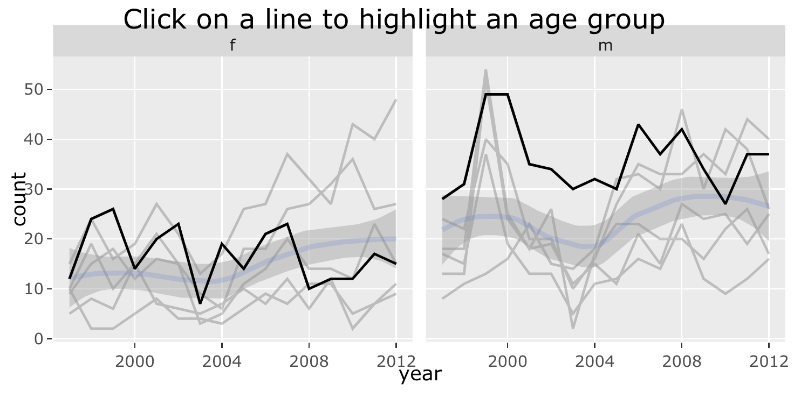

```{r, include = FALSE}
current_file <- knitr::current_input()
```
```{r titleslide, child="assets/titleslide.Rmd"}
```
```{r, include = FALSE}
knitr::opts_chunk$set(
  fig.path = "images/day2-session3/",
  fig.width = 6,
  fig.height = 4,
  fig.align = "center",
  out.width = "100%",
  fig.retina = 3,
  warning = FALSE,
  message = FALSE,
  cache = TRUE,
  cache.path = "cache/"
)
```

```{r, include = FALSE}
library(tidyverse)
filter <- dplyr::filter
select <- dplyr::select
library(ggthemes)
library(viridis)
library(leaflet)
library(plotly)
library(gganimate)
library(ggmap)
library(lubridate)
library(gapminder)
```

---
# Applying interactivity and animation

.top10-color-box[The purpose of interactivity is to display more than can be achieved with persistent plot elements, and to invite the reader to engage with the plot.]
--

<br><br><br><br>
.pull-left[
- .monash-orange2[Mouse-over] labels .monash-blue2[de-clutters] a plot

- .monash-orange2[Pan/zoom] allows .monash-blue2[re-focusing] attention

- .monash-orange2[Selection] allows .monash-blue2[focusing] attention
 
- .monash-orange2[Linking] .monash-blue2[connects elements] from multiple plots

]
--

.pull-right[
.monash-orange2[Animation] allows more information to be displayed, but .monash-blue2[developer keeps control]. Beware that it is easy to .monash-orange2[forget] what was just displayed, so keeping some elements persistent, maybe faint, can be useful for the reader.
]

---
class: transition middle 

# Interactive maps

---
# Leaflet

.font_small[
```{r platy_leaflet, fig.show='hide', results='hide'}
load(here::here("data/platypus.rda"))
platypus <- platypus %>%
  filter(year(eventDate) > 2018) 
platypus %>%
  leaflet() %>%
  addTiles() %>% #<<
  addCircleMarkers( #<<
    radius = 1, opacity = 0.5, color = "orange", label = ~eventDate, #<<
    lat = ~Latitude, lng = ~Longitude) #<<
```
]

---

```{r ref.label="platy_leaflet", echo=FALSE, fig.height=8, fig.width=8}
```

```{r eval=FALSE, echo=FALSE}
# Exercise 1, leaflet, with different color, opacity?
```

---
class: transition middle 

# Reflection on leaflet

<br>
<br>

.pull-left[
## Advantages    

fast, scalable, reliable

many map formats 

]
--

.pull-right[
## Disadvantages

specialist syntax

limited capabilities

]

---
# Building on ggplot with `plotly`

.font_small[
```{r platy_plotly, fig.show='hide', results='hide'}
load(here::here("data/oz_map.rda"))
p <- ggmap(oz_map) + 
  geom_point(data = platypus, 
             aes(x = Longitude, y = Latitude, label=eventDate), 
             alpha = 0.5, colour = "orange") + 
  theme_map()
ggplotly(p, tooltip = "label") #<<
```
]

---

<center>
```{r ref.label="platy_plotly", echo=FALSE, fig.width=10, fig.height=8, fig.align="center", out.width="80%"}

```
</center>

---
.font_small[
```{r tbtidy, echo=FALSE}
tb <- read_csv(here::here("data/TB_notifications_2020-07-01.csv")) %>% 
  dplyr::select(country, iso3, year, new_sp_m04:new_sp_fu) %>%
  pivot_longer(cols = new_sp_m04:new_sp_fu, names_to = "sexage", values_to = "count") %>%
  mutate(sexage = str_replace(sexage, "new_sp_", "")) %>%
  mutate(sex = substr(sexage, 1, 1), 
         age = substr(sexage, 2, length(sexage))) %>%
  dplyr::select(-sexage) %>%
  filter(!(age %in% c("04", "014", "514", "u"))) %>%
  filter(year > 1996, year < 2013) %>%
  mutate(age_group = factor(age, 
                            labels = c("15-24", "25-34", "35-44", 
                                       "45-54", "55-64", "65-"))) %>%
  dplyr::select(country, year, age_group, sex, count)

# Filter Australia
tb_oz <- tb %>% 
  filter(country == "Australia") 
```
]

.font_small[
```{r tb_count_trend, fig.show='hide', results='hide'}
p1 <- ggplot(tb_oz, aes(x = year, y = count, fill = sex)) +
  geom_bar(stat = "identity", position = "fill") + #<<
  facet_wrap(~age_group, ncol = 6) +
  scale_fill_brewer(name = "Sex", palette = "Dark2") 
ggplotly(p1)
```
]

<br>
<br>
```{r ref.label='tb_count_trend', echo=FALSE, fig.width=10, fig.height=4, out.width="90%"}
```


---
# Modifying plotly 

`plotly` uses elements of `crosstalk` to provide additional interactivity, such as linked highlighting. It only runs in a shiny environment, eg RStudio plot window, so copy the block of code into your R window. 

.font_small[
```{r eval=FALSE}
tb_action <- highlight_key(tb_oz, ~age_group) #<<

p2 <- ggplot(tb_action, aes(x = year, y = count)) + #<<
  geom_line(aes(group = age_group)) +
  geom_smooth() + 
  facet_wrap(~sex)  

gg <- ggplotly(p2, height = 300, width = 600) %>%
   layout(title = "Click on a line to highlight an age group")

highlight(gg) #<<
```
]

---



```{r eval=FALSE, echo=FALSE}
# Exercise 2 for students map age to colour and see if it works
```

---
# Animations

- `gganimate` (Lin-Pederson) allows to make and save animations (also `plotly` can too)
- Animations are different from interactive graphics in that the viewer does not have any control
- useful for different important stages of a visualization (e.g. time) and to keep track of how different visualizations are related 
--

- .monash-orange2[makes slides come alive in talks.]

---
# An example animation

```{r gapminder, echo=FALSE, fig.width = 7, fig.height = 4.5, out.width="60%", cache=TRUE}
ggplot(gapminder, aes(gdpPercap, lifeExp, size = pop, colour = country)) +
  geom_point(alpha = 0.7) +
  scale_colour_manual(values = country_colors, guide=FALSE) +
  scale_size("Population size", range = c(2, 12), breaks=c(1*10^8, 2*10^8, 5*10^8, 10^9, 2*20^9)) +
  scale_x_log10() +
  facet_wrap(~continent) +
  theme(legend.position = "none") +
  # Here comes the gganimate specific bits
  labs(title = 'Year: {frame_time}', #<<
       x = 'GDP per capita', #<<
       y = 'life expectancy') + #<<
  gganimate::transition_time(year) + #<<
  gganimate::ease_aes('linear') #<<
```

Countries are colored manually by `country_colors` (hue shows continent, saturation is individual country)

---
# How does `gganimate` work?


#### Start with a ggplot2 specification 
--

#### Add layers with graphical primitives (geoms)

--

#### Add formatting specifications

--

#### Add animation specifications

---
# A simple example

- thanks to Mitch O'Hara Wild for the [example](https://slides.mitchelloharawild.com/wombat-gganimate/#1)

#### 1. Start by passing the data to ggplot

.left-code[
```{r plot1, echo=TRUE, results='hide', fig.show='hide'}
ggplot(economics) #<<
```
]
.right-plot[
```{r output1, ref.label="plot1", echo=FALSE, cache=TRUE}
```
]

---
# A simple example

- thanks to Mitch O'Hara Wild for the [example](https://slides.mitchelloharawild.com/wombat-gganimate/#1)

#### 2. add the mapping

.left-code[
```{r plot2, echo=TRUE, results='hide', fig.show='hide'}
ggplot(economics) +
  aes(date, unemploy) #<<
```
]
.right-plot[
```{r output2, ref.label="plot2", echo=FALSE, cache=TRUE}
```
]


---
# A simple example

- thanks to Mitch O'Hara Wild for the [example](https://slides.mitchelloharawild.com/wombat-gganimate/#1)

#### 3.add a graphical primitive, let's do a line 

.left-code[
```{r plot3, echo=TRUE, results='hide', fig.show='hide'}
ggplot(economics) +
  aes(date, unemploy) +
  geom_line() #<<
```
]
.right-plot[
```{r output3, ref.label="plot3", echo=FALSE, cache=TRUE}
```
]

---
# A simple example

- thanks to Mitch O'Hara Wild for the [example](https://slides.mitchelloharawild.com/wombat-gganimate/#1)

#### 4. Just one extra line turns this into an animation!

.left-code[
```{r plot5-anim, echo=TRUE, results='hide', fig.show='hide'}
ggplot(economics) +
  aes(date, unemploy) +
  geom_line() +
  transition_reveal(date) #<<
```
]
.right-plot[
```{r output5-anim, ref.label="plot5-anim", echo=FALSE, cache=TRUE}
```
]

---
class: font_smaller2
# Controlling an animation

We control plot movement with (a grammar of animation):


- Transitions: `transition_*()` define how the data should be spread out and how it relates to itself across time.
--

- Views: `view_*()` defines how the positional scales should change along the animation.
--

- Shadows: `shadow_*()` defines how data from other points in time should be presented in the given point in time.
--

- Entrances/Exits: `enter_*()` and `exit_*()` define how new data should appear and how old data should disappear during the course of the animation.
--

- Easing: `ease_aes()` defines how different aesthetics should be eased during transitions.

---

.font-smaller[
```{r ref.label="gapminder", echo=TRUE, eval=FALSE}
```
]

---
## A not-so-simple example, the datasaurus dozen
Again, we first pass in the dataset to ggplot

.left-code[
.font_small[
```{r plot5, echo=TRUE, results='hide', fig.show='hide'}
library(datasauRus)
ggplot(datasaurus_dozen)#<<
```
]]
.right-plot[
```{r output5, ref.label="plot5", echo=FALSE, cache=TRUE}
```
]

---
# What's in the data?

```{r echo=FALSE}
DT::datatable(datasaurus_dozen, width=1150, height=200)
```

---
## A not-so-simple example, the datasaurus dozen
For each dataset we have x and y values, in addition we can map dataset to color

.left-code[
.font_small[
```{r plot6, echo=TRUE, results='hide', fig.show='hide'}
ggplot(datasaurus_dozen) +
  aes(x, y, color = dataset)#<<
```
]]
.right-plot[
```{r output6, ref.label="plot6", echo=FALSE, cache=TRUE}
```
]
---
## A not-so-simple example, the datasaurus dozen
Trying a simple scatter plot first, but there is too much information

.left-code[
.font_small[
```{r plot7, echo=TRUE, results='hide', fig.show='hide'}
ggplot(datasaurus_dozen) +
  aes(x, y, color = dataset) +
  geom_point() + #<<
  theme(aspect.ratio = 1)
```
]]
.right-plot[
```{r output7, ref.label="plot7", echo=FALSE, cache=TRUE}
```
]
---
## A not-so-simple example, the datasaurus dozen

We can use facets to split up by dataset, revealing the different distributions

.left-code[
.font_small[
```{r plot8, echo=TRUE, results='hide', fig.show='hide', fig.height=5}
ggplot(datasaurus_dozen) +
  aes(x, y, color = dataset) +
  geom_point() +
  facet_wrap(~dataset) + #<<
  theme(aspect.ratio = 1)
```
]]
.right-plot[
```{r output8, ref.label="plot8", echo=FALSE, cache=TRUE, fig.width=8, fig.height=6, out.width="100%"}
```
]
---
## A not-so-simple example, the datasaurus dozen
We can just as easily turn it into an animation, transitioning between dataset states! 

.left-code[
.font_small[
```{r plot9, echo=TRUE, results='hide', fig.show='hide'}
ggplot(datasaurus_dozen) +
  aes(x, y) +
  geom_point() +
  transition_states(dataset, 3, 1) + #<<
  labs(title = "Dataset: {closest_state}") + #<<
  theme(aspect.ratio = 1)
```
]]
.right-plot[
```{r output9, ref.label="plot9", echo=FALSE, cache=TRUE}
```
]

```{r eval=FALSE, echo=FALSE}
# Exercise 3 subset TB data to Australia, colour over years

```
---
# Resources

- Carson Sievert [Interactive web-based data visualization with R, plotly, and shiny](https://plotly-r.com)
- website for [gganimate](https://gganimate.com/)
- Mitch O'Hara-Wild's [tutorial on gganimate](https://github.com/numbats/gganimate-workshop)

---

class: exercise middle hide-slide-number


<i class="fas fa-users"></i>

# <i class="fas fa-code"></i> Open `part2-exercise-03.Rmd`

<center>
`r countdown::countdown(15, class = "clock")`
</center>


---

```{r endslide, child="assets/endslide.Rmd"}
```

